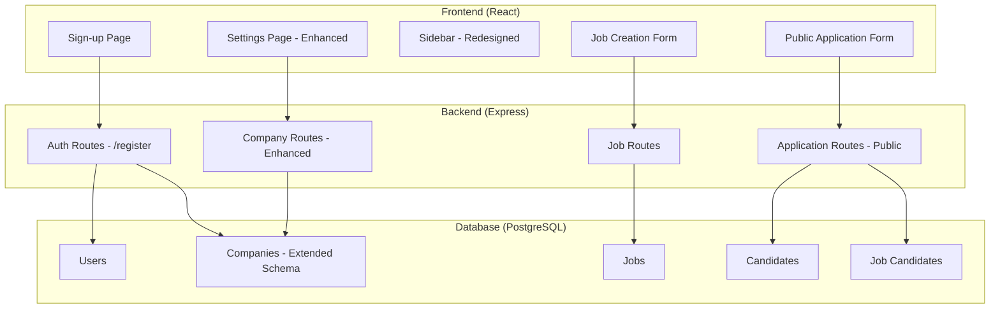
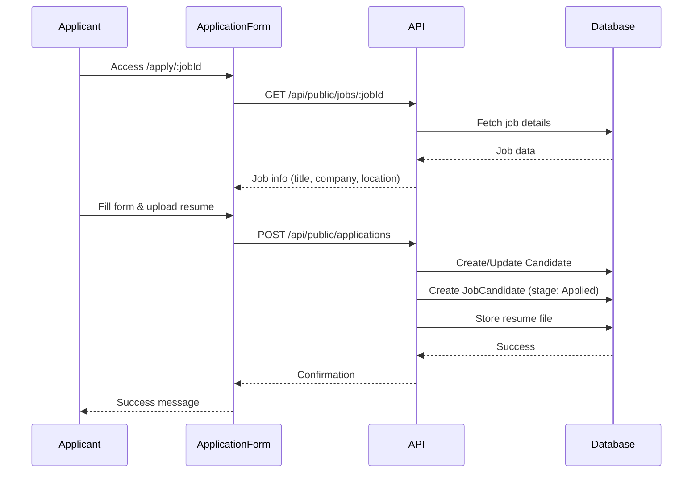

# Design Document: ATS Enhancements Phase 2

## Overview

This design document outlines the architecture and implementation details for Phase 2 enhancements of the ATS Portal. The enhancements include admin sign-up functionality, comprehensive company profile setup, sidebar UI redesign with React Icons, job creation workflow improvements, and a public job application form for candidates.

### Technology Stack

- **Frontend**: React 18+ with TypeScript, React Router, Tailwind CSS, React Icons
- **Backend**: Node.js with Express.js, TypeScript
- **Database**: PostgreSQL with Prisma ORM
- **Authentication**: JWT (JSON Web Tokens) with bcrypt for password hashing
- **File Upload**: Multer for resume handling
- **State Management**: React Context API, React Query for server state

### Design Principles

1. **Component-Based Architecture**: Reusable UI components with React Icons
2. **Type Safety**: Full TypeScript coverage
3. **Responsive Design**: Mobile-first approach
4. **Consistent Theming**: Blue (#0b6cf0) and white theme with modern hover states

## Architecture



### Public Application Flow



## Components and Interfaces

### Frontend Components

#### Sign-up Page Component

```typescript
interface SignupFormData {
  fullName: string;
  email: string;
  password: string;
  confirmPassword: string;
  companyName: string;
}

interface SignupPageProps {
  onSuccess: () => void;
}
```

#### Enhanced Company Profile Component

```typescript
interface CompanyProfile {
  // Basic Details
  id: string;
  name: string;
  website: string;
  companySize: string;
  industry: string;
  description: string;
  
  // Branding
  logoUrl: string;
  brandColor: string;
  
  // Contact & Location
  contactEmail: string;
  phone: string;
  address: string;
  city: string;
  state: string;
  country: string;
  postalCode: string;
  
  // Social Media
  linkedinUrl: string;
  twitterUrl: string;
  facebookUrl: string;
  careersPageUrl: string;
}

const companySizes = [
  '1-10 employees',
  '11-50 employees',
  '51-200 employees',
  '201-500 employees',
  '501-1000 employees',
  '1000+ employees'
];

const industries = [
  'Technology',
  'Healthcare',
  'Finance',
  'Education',
  'Manufacturing',
  'Retail',
  'Consulting',
  'Media',
  'Real Estate',
  'Other'
];
```

#### Redesigned Sidebar Component

```typescript
import { 
  MdDashboard, 
  MdWork, 
  MdPeople, 
  MdEvent, 
  MdAnalytics, 
  MdSettings,
  MdMenu,
  MdLogout,
  MdAdd
} from 'react-icons/md';

interface NavItem {
  path: string;
  label: string;
  icon: React.ComponentType<{ className?: string }>;
}

interface SidebarProps {
  collapsed: boolean;
  onToggle: () => void;
  user: User | null;
  onLogout: () => void;
}

// Navigation items with React Icons
const navItems: NavItem[] = [
  { path: '/dashboard', label: 'Dashboard', icon: MdDashboard },
  { path: '/roles', label: 'Roles & Pipelines', icon: MdWork },
  { path: '/candidates', label: 'Candidates', icon: MdPeople },
  { path: '/interviews', label: 'Interviews', icon: MdEvent },
  { path: '/analytics', label: 'Analytics & Reports', icon: MdAnalytics },
  { path: '/settings', label: 'Settings', icon: MdSettings },
];

// Sidebar styling - full blue hover/active
const sidebarStyles = {
  navItem: {
    default: 'text-[#374151] hover:bg-[#0b6cf0] hover:text-white',
    active: 'bg-[#0b6cf0] text-white',
  },
  userSection: 'border-t border-[#e2e8f0] mt-auto',
  menuIcon: 'p-3 hover:bg-[#f8fafc] rounded-lg cursor-pointer',
};
```

#### Public Job Application Form Component

```typescript
interface ApplicationFormData {
  // Step 1: Personal Information
  fullName: string;
  email: string;
  phone: string;
  currentLocation: string;
  linkedinProfile: string;
  portfolioUrl: string;
  
  // Step 2: Resume Upload
  resumeFile: File | null;
  
  // Step 3: Additional Information
  coverLetter: string;
  desiredSalary: string;
  workAuthorization: 'yes' | 'no' | null;
  
  // Agreement
  agreedToTerms: boolean;
}

interface ApplicationFormProps {
  jobId: string;
  jobTitle: string;
  companyName: string;
  location: string;
  jobType: string;
}

// Multi-step form configuration
const formSteps = [
  { id: 1, title: 'Personal Information', progress: 25 },
  { id: 2, title: 'Resume / CV', progress: 50 },
  { id: 3, title: 'Additional Information', progress: 75 },
  { id: 4, title: 'Review & Submit', progress: 100 },
];
```

### Backend API Interfaces

```typescript
// Registration endpoint
POST /api/auth/register
  Request: {
    fullName: string;
    email: string;
    password: string;
    companyName: string;
  }
  Response: {
    success: boolean;
    message: string;
  }

// Enhanced company endpoints
GET /api/companies/:id
PUT /api/companies/:id
  Request: CompanyProfile
  Response: CompanyProfile

// Public job endpoint (no auth required)
GET /api/public/jobs/:id
  Response: {
    id: string;
    title: string;
    companyName: string;
    location: string;
    employmentType: string;
    description: string;
  }

// Public application endpoint (no auth required)
POST /api/public/applications
  Request: FormData (multipart)
    - jobId: string
    - fullName: string
    - email: string
    - phone: string
    - currentLocation: string
    - linkedinProfile?: string
    - portfolioUrl?: string
    - coverLetter?: string
    - desiredSalary?: string
    - workAuthorization: 'yes' | 'no'
    - resume: File
  Response: {
    success: boolean;
    applicationId: string;
    message: string;
  }
```

## Data Models

### Extended Company Schema

```prisma
model Company {
  id              String   @id @default(uuid())
  name            String
  website         String?
  companySize     String?  @map("company_size")
  industry        String?
  description     String?  @db.Text
  
  // Branding
  logoUrl         String?  @map("logo_url")
  brandColor      String?  @map("brand_color") @default("#0b6cf0")
  
  // Contact & Location
  contactEmail    String   @map("contact_email")
  phone           String?
  address         String?
  city            String?
  state           String?
  country         String?
  postalCode      String?  @map("postal_code")
  
  // Social Media
  linkedinUrl     String?  @map("linkedin_url")
  twitterUrl      String?  @map("twitter_url")
  facebookUrl     String?  @map("facebook_url")
  careersPageUrl  String?  @map("careers_page_url")
  
  createdAt       DateTime @default(now()) @map("created_at")
  updatedAt       DateTime @updatedAt @map("updated_at")

  users           User[]
  jobs            Job[]
  candidates      Candidate[]

  @@map("companies")
}
```

### TypeScript Types

```typescript
// Extended Company type
interface Company {
  id: string;
  name: string;
  website?: string;
  companySize?: string;
  industry?: string;
  description?: string;
  logoUrl?: string;
  brandColor?: string;
  contactEmail: string;
  phone?: string;
  address?: string;
  city?: string;
  state?: string;
  country?: string;
  postalCode?: string;
  linkedinUrl?: string;
  twitterUrl?: string;
  facebookUrl?: string;
  careersPageUrl?: string;
  createdAt: Date;
  updatedAt: Date;
}

// Registration request type
interface RegisterRequest {
  fullName: string;
  email: string;
  password: string;
  companyName: string;
}

// Public application type
interface PublicApplication {
  jobId: string;
  fullName: string;
  email: string;
  phone: string;
  currentLocation: string;
  linkedinProfile?: string;
  portfolioUrl?: string;
  coverLetter?: string;
  desiredSalary?: string;
  workAuthorization: 'yes' | 'no';
  resumeFile: File;
}
```

## Correctness Properties

*A property is a characteristic or behavior that should hold true across all valid executions of a system-essentially, a formal statement about what the system should do. Properties serve as the bridge between human-readable specifications and machine-verifiable correctness guarantees.*

Based on the acceptance criteria analysis, the following correctness properties must be validated:

### Registration Properties

**Property 1: Registration creates user and company**
*For any* valid registration data (full name, email, password, company name), submitting the registration should create both a user record with admin role and a company record, both retrievable from the database.
**Validates: Requirements 1.2**

**Property 2: Password validation rules**
*For any* password string, if the password is less than 8 characters OR does not match the confirm password field, the registration validation should fail with appropriate error message.
**Validates: Requirements 1.3**

**Property 3: Duplicate email prevention on registration**
*For any* email that already exists in the database, attempting to register with that email should fail with an error indicating the email is already registered.
**Validates: Requirements 1.4**

### Company Profile Properties

**Property 4: Company profile round-trip**
*For any* valid company profile data (including all extended fields: website, size, industry, description, branding, contact, location, social media), saving the profile and then retrieving it should return an equivalent company object with all fields matching.
**Validates: Requirements 2.7, 7.1, 7.2, 7.3, 7.4**

### Sidebar Properties

**Property 5: Sidebar toggle state**
*For any* initial sidebar state (expanded or collapsed), clicking the menu toggle icon should change the state to the opposite value (expanded becomes collapsed, collapsed becomes expanded).
**Validates: Requirements 3.8**

### Job Creation Properties

**Property 6: Job validation rejects missing required fields**
*For any* job data missing a required field (title, department, or location), the job creation validation should fail with appropriate error message.
**Validates: Requirements 4.2**

**Property 7: Job creation with pipeline stages**
*For any* valid job data, creating a job should store it in the database with all provided details and automatically create default pipeline stages (Queue, Applied, Screening, Shortlisted, Interview, Selected, Offer, Hired).
**Validates: Requirements 4.3**

**Property 8: Unique job application URLs**
*For any* set of created jobs, each job should have a unique public application URL that can be used to access the application form.
**Validates: Requirements 4.4**

### Application Form Properties

**Property 9: Resume file validation**
*For any* uploaded file, only files with valid formats (PDF, DOC, DOCX) and size under 5MB should be accepted. Invalid files should be rejected with appropriate error messages.
**Validates: Requirements 5.5**

**Property 10: Terms agreement required**
*For any* application submission, if the agreedToTerms field is false, the submission should fail with an error requiring agreement to terms.
**Validates: Requirements 5.9**

**Property 11: Application submission round-trip**
*For any* valid application data (personal info, resume, additional info with terms agreed), submitting the application should create a candidate record and job association that can be retrieved from the database.
**Validates: Requirements 5.10, 6.1**

**Property 12: Existing email updates candidate**
*For any* application submitted with an email that already exists in the candidate database, the system should update the existing candidate record and add a new job application association rather than creating a duplicate.
**Validates: Requirements 5.12**

**Property 13: Initial pipeline stage is Applied**
*For any* submitted application, the candidate should be associated with the job in the "Applied" pipeline stage.
**Validates: Requirements 6.2**

## Error Handling

### Frontend Error Handling

```typescript
// Registration errors
interface RegistrationError {
  field?: 'email' | 'password' | 'confirmPassword' | 'fullName' | 'companyName';
  message: string;
}

// Application form errors
interface ApplicationError {
  step: number;
  field: string;
  message: string;
}

// File upload errors
const fileErrors = {
  invalidFormat: 'Please upload a PDF, DOC, or DOCX file',
  fileTooLarge: 'File size must be less than 5MB',
  uploadFailed: 'Failed to upload file. Please try again.',
};
```

### Backend Error Handling

```typescript
// Registration validation
class RegistrationValidationError extends AppError {
  constructor(field: string, message: string) {
    super(400, 'REGISTRATION_VALIDATION_ERROR', message, { [field]: [message] });
  }
}

// Duplicate email error
class DuplicateEmailError extends AppError {
  constructor() {
    super(409, 'DUPLICATE_EMAIL', 'An account with this email already exists');
  }
}

// File validation error
class FileValidationError extends AppError {
  constructor(message: string) {
    super(400, 'FILE_VALIDATION_ERROR', message);
  }
}
```

## Testing Strategy

### Dual Testing Approach

This project uses both unit testing and property-based testing:

- **Unit tests** verify specific examples, edge cases, and UI rendering
- **Property-based tests** verify universal properties across all valid inputs

### Testing Framework

- **Unit Testing**: Vitest with React Testing Library
- **Property-Based Testing**: fast-check library for TypeScript
- **Integration Testing**: Supertest for API endpoints

### Property-Based Testing Configuration

```typescript
import fc from 'fast-check';

// Configure minimum 100 iterations per property test
fc.configureGlobal({
  numRuns: 100,
  verbose: true
});
```

### Property Test Examples

```typescript
// **Feature: ats-enhancements-phase2, Property 2: Password validation rules**
describe('Property 2: Password validation rules', () => {
  it('should reject passwords shorter than 8 characters', () => {
    fc.assert(
      fc.property(
        fc.string({ maxLength: 7 }),
        (password) => {
          const result = validatePassword(password, password);
          return result.valid === false && result.error.includes('8 characters');
        }
      )
    );
  });

  it('should reject mismatched passwords', () => {
    fc.assert(
      fc.property(
        fc.string({ minLength: 8 }),
        fc.string({ minLength: 8 }),
        (password, confirmPassword) => {
          fc.pre(password !== confirmPassword);
          const result = validatePassword(password, confirmPassword);
          return result.valid === false && result.error.includes('match');
        }
      )
    );
  });
});

// **Feature: ats-enhancements-phase2, Property 9: Resume file validation**
describe('Property 9: Resume file validation', () => {
  it('should accept valid file formats under 5MB', () => {
    fc.assert(
      fc.property(
        fc.constantFrom('pdf', 'doc', 'docx'),
        fc.integer({ min: 1, max: 5 * 1024 * 1024 }),
        (extension, size) => {
          const file = createMockFile(`resume.${extension}`, size);
          const result = validateResumeFile(file);
          return result.valid === true;
        }
      )
    );
  });

  it('should reject files over 5MB', () => {
    fc.assert(
      fc.property(
        fc.constantFrom('pdf', 'doc', 'docx'),
        fc.integer({ min: 5 * 1024 * 1024 + 1, max: 20 * 1024 * 1024 }),
        (extension, size) => {
          const file = createMockFile(`resume.${extension}`, size);
          const result = validateResumeFile(file);
          return result.valid === false;
        }
      )
    );
  });
});
```

### Test File Structure

```
src/
├── __tests__/
│   ├── properties/
│   │   ├── registration.property.test.ts
│   │   ├── company-profile.property.test.ts
│   │   ├── sidebar.property.test.ts
│   │   ├── job-creation.property.test.ts
│   │   └── application.property.test.ts
│   └── unit/
│       ├── SignupPage.test.tsx
│       ├── Sidebar.test.tsx
│       └── ApplicationForm.test.tsx
```

