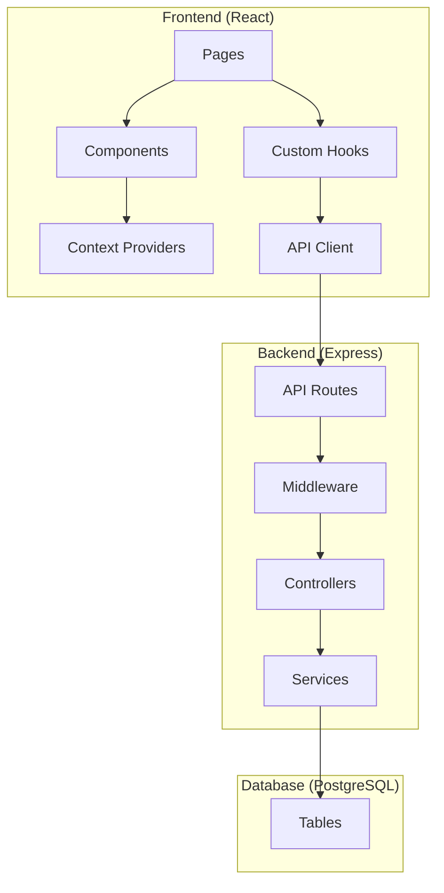
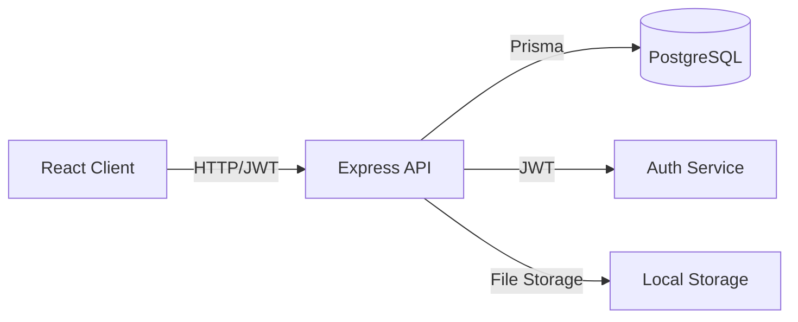
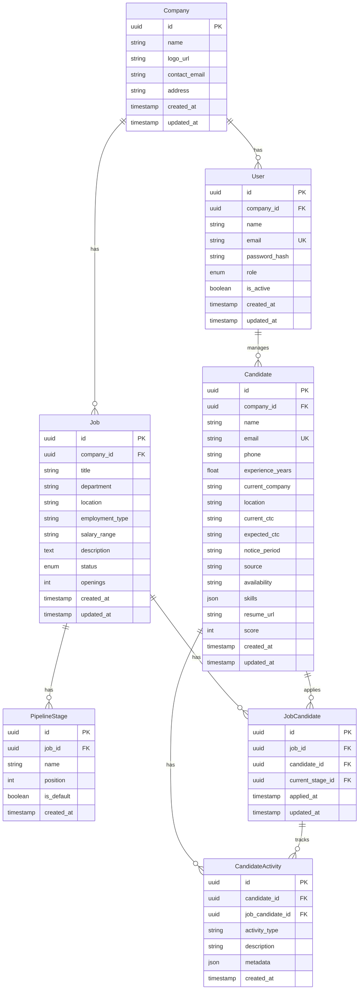

# Design Document: ATS Portal Phase 1

## Overview

This design document outlines the architecture and implementation details for Phase 1 of the ATS (Applicant Tracking System) Portal. The system provides core infrastructure for managing recruitment workflows including user authentication, company setup, job requisitions, and candidate management.

### Technology Stack

- **Frontend**: React 18+ with TypeScript, React Router for navigation, Tailwind CSS for styling
- **Backend**: Node.js with Express.js, TypeScript
- **Database**: PostgreSQL with Prisma ORM
- **Authentication**: JWT (JSON Web Tokens) with bcrypt for password hashing
- **State Management**: React Context API for global state, React Query for server state

### Design Principles

1. **Component-Based Architecture**: Reusable UI components following atomic design principles
2. **Type Safety**: Full TypeScript coverage for both frontend and backend
3. **Responsive Design**: Mobile-first approach with breakpoints at 720px, 900px, and 1200px
4. **Consistent Theming**: Blue (#0b6cf0) and white theme with dark sidebar (#020617)

## Architecture



### System Architecture



## Components and Interfaces

### Frontend Components

#### Layout Components

```typescript
// Layout wrapper with sidebar and header
interface LayoutProps {
  children: React.ReactNode;
  pageTitle: string;
  pageSubtitle?: string;
  headerActions?: React.ReactNode;
}

// Sidebar navigation component
interface SidebarProps {
  collapsed: boolean;
  onToggle: () => void;
  currentPath: string;
  user: User;
}

// Header component
interface HeaderProps {
  pageTitle: string;
  pageSubtitle?: string;
  onMenuToggle: () => void;
  actions?: React.ReactNode;
  user: User;
}

// Footer component
interface FooterProps {
  leftText: string;
  rightText?: string;
}
```

#### Page Components

```typescript
// Dashboard page
interface DashboardPageProps {
  metrics: DashboardMetrics;
  roles: Role[];
  interviews: Interview[];
  tasks: Task[];
  alerts: Alert[];
}

// Roles & Pipelines page
interface RolesPageProps {
  roles: Role[];
  selectedRole?: Role;
  candidates: Candidate[];
  viewMode: 'table' | 'board';
}

// Candidate Database page
interface CandidatePageProps {
  candidates: Candidate[];
  filters: CandidateFilters;
  insights: DatabaseInsights;
}

// Settings page
interface SettingsPageProps {
  company: Company;
  users: User[];
  roles: RoleConfig[];
}
```

#### Shared Components

```typescript
// KPI Card
interface KPICardProps {
  label: string;
  value: string | number;
  subtitle?: string;
  trend?: { text: string; type: 'ok' | 'warn' | 'bad' };
  chip?: string;
}

// Badge component
interface BadgeProps {
  text: string;
  variant: 'green' | 'orange' | 'red' | 'blue' | 'gray';
}

// Button component
interface ButtonProps {
  variant: 'primary' | 'secondary' | 'outline' | 'text' | 'mini';
  children: React.ReactNode;
  onClick?: () => void;
  disabled?: boolean;
  icon?: React.ReactNode;
}

// Table component
interface TableProps<T> {
  columns: Column<T>[];
  data: T[];
  onRowClick?: (row: T) => void;
  selectedRow?: T;
  loading?: boolean;
}

// Detail Panel (sliding panel)
interface DetailPanelProps {
  isOpen: boolean;
  onClose: () => void;
  title: string;
  subtitle?: string;
  children: React.ReactNode;
}

// Kanban Board
interface KanbanBoardProps {
  stages: Stage[];
  candidates: Candidate[];
  onCandidateMove: (candidateId: string, newStage: string) => void;
  onCandidateClick: (candidate: Candidate) => void;
}
```

### Backend API Interfaces

```typescript
// Authentication endpoints
POST /api/auth/login
  Request: { email: string; password: string }
  Response: { token: string; user: User }

POST /api/auth/logout
  Request: { token: string }
  Response: { success: boolean }

// Company endpoints
GET /api/companies/:id
POST /api/companies
PUT /api/companies/:id

// User endpoints
GET /api/users
POST /api/users
PUT /api/users/:id
DELETE /api/users/:id

// Job endpoints
GET /api/jobs
GET /api/jobs/:id
POST /api/jobs
PUT /api/jobs/:id
DELETE /api/jobs/:id

// Candidate endpoints
GET /api/candidates
GET /api/candidates/:id
POST /api/candidates
PUT /api/candidates/:id
POST /api/candidates/:id/resume

// Pipeline endpoints
GET /api/jobs/:jobId/pipeline
PUT /api/candidates/:id/stage
```

## Data Models

### Database Schema



### TypeScript Types

```typescript
// User types
type UserRole = 'admin' | 'hiring_manager' | 'recruiter';

interface User {
  id: string;
  companyId: string;
  name: string;
  email: string;
  role: UserRole;
  isActive: boolean;
  createdAt: Date;
  updatedAt: Date;
}

// Company types
interface Company {
  id: string;
  name: string;
  logoUrl?: string;
  contactEmail: string;
  address?: string;
  createdAt: Date;
  updatedAt: Date;
}

// Job types
type JobStatus = 'active' | 'paused' | 'closed';

interface Job {
  id: string;
  companyId: string;
  title: string;
  department: string;
  location: string;
  employmentType: string;
  salaryRange?: string;
  description: string;
  status: JobStatus;
  openings: number;
  createdAt: Date;
  updatedAt: Date;
  stages?: PipelineStage[];
  candidateCount?: number;
}

// Pipeline types
interface PipelineStage {
  id: string;
  jobId: string;
  name: string;
  position: number;
  isDefault: boolean;
  candidateCount?: number;
}

// Candidate types
interface Candidate {
  id: string;
  companyId: string;
  name: string;
  email: string;
  phone?: string;
  experienceYears: number;
  currentCompany?: string;
  location: string;
  currentCtc?: string;
  expectedCtc?: string;
  noticePeriod?: string;
  source: string;
  availability?: string;
  skills: string[];
  resumeUrl?: string;
  score?: number;
  createdAt: Date;
  updatedAt: Date;
  currentStage?: string;
  jobApplications?: JobApplication[];
}

interface JobApplication {
  id: string;
  jobId: string;
  candidateId: string;
  currentStageId: string;
  appliedAt: Date;
  updatedAt: Date;
}

// Activity types
type ActivityType = 'stage_change' | 'note_added' | 'resume_uploaded' | 'interview_scheduled' | 'score_updated';

interface CandidateActivity {
  id: string;
  candidateId: string;
  jobCandidateId?: string;
  activityType: ActivityType;
  description: string;
  metadata?: Record<string, any>;
  createdAt: Date;
}

// Dashboard types
interface DashboardMetrics {
  openRoles: number;
  activeCandidates: number;
  interviewsToday: number;
  offersPending: number;
  timeToFillMedian: number;
  offerAcceptanceRate: number;
}

interface Alert {
  id: string;
  level: 'critical' | 'warning' | 'info';
  message: string;
  action: string;
}

interface Task {
  id: string;
  type: 'Feedback' | 'Approval' | 'Reminder' | 'Pipeline';
  text: string;
  age: string;
  severity: 'high' | 'medium' | 'low';
}
```


## Correctness Properties

*A property is a characteristic or behavior that should hold true across all valid executions of a system-essentially, a formal statement about what the system should do. Properties serve as the bridge between human-readable specifications and machine-verifiable correctness guarantees.*

Based on the acceptance criteria analysis, the following correctness properties must be validated:

### Authentication Properties

**Property 1: Valid credentials produce valid JWT token**
*For any* valid user credentials (email and password pair that exists in the database), submitting them to the login endpoint should return a valid JWT token containing the user's ID and role.
**Validates: Requirements 1.1**

**Property 2: Invalid credentials produce generic error**
*For any* invalid credentials (non-existent email or wrong password), the authentication system should return an error message that does not reveal which specific credential was incorrect.
**Validates: Requirements 1.2**

### Company Properties

**Property 3: Company creation round-trip**
*For any* valid company data (name, logo URL, contact email, address), creating a company and then retrieving it should return an equivalent company object with all fields matching.
**Validates: Requirements 2.1, 2.2**

**Property 4: Company IDs are unique**
*For any* set of created companies, all company IDs should be unique (no two companies share the same ID).
**Validates: Requirements 2.3**

### RBAC Properties

**Property 5: Role-based access restriction**
*For any* user with a specific role and any feature, the user should only be able to access features permitted for their role. Attempting to access restricted features should be denied.
**Validates: Requirements 3.1, 3.5**

### User Management Properties

**Property 6: User creation round-trip**
*For any* valid user data (name, email, role), creating a user and then retrieving it should return an equivalent user object with all fields matching (password should be hashed, not plaintext).
**Validates: Requirements 4.1**

**Property 7: Deactivated users cannot login**
*For any* deactivated user, attempting to login with their credentials should fail, but their historical data should still exist in the database.
**Validates: Requirements 4.3**

### Job Requisition Properties

**Property 8: Job creation round-trip**
*For any* valid job data (title, department, location, salary range, description), creating a job and then retrieving it should return an equivalent job object with all fields matching.
**Validates: Requirements 5.1**

**Property 9: Job IDs are unique and status is active**
*For any* newly created job, it should have a unique ID and its initial status should be 'active'.
**Validates: Requirements 5.2**

**Property 10: Job validation rejects missing required fields**
*For any* job data missing a required field (title, department, or location), the job creation should fail with a validation error.
**Validates: Requirements 5.3**

### Pipeline Properties

**Property 11: Default stages are initialized**
*For any* newly created job, the pipeline should contain the default stages (Queue, Applied, Screening, Shortlisted, Interview, Selected, Offer, Hired) in the correct order.
**Validates: Requirements 6.1**

**Property 12: Custom sub-stage insertion preserves order**
*For any* pipeline and custom sub-stage inserted at position N, the sub-stage should appear at position N and all subsequent stages should have their positions incremented.
**Validates: Requirements 6.2**

**Property 13: Stage reordering maintains candidate associations**
*For any* pipeline with candidates, reordering stages should update stage positions while maintaining all candidate-stage associations correctly.
**Validates: Requirements 6.4**

### Candidate Properties

**Property 14: Candidate creation round-trip**
*For any* valid candidate data (name, email, phone, experience, skills), creating a candidate and then retrieving it should return an equivalent candidate object with all fields matching.
**Validates: Requirements 8.1**

**Property 15: Candidate IDs are unique**
*For any* set of created candidates, all candidate IDs should be unique.
**Validates: Requirements 8.2**

**Property 16: Duplicate email prevention**
*For any* existing candidate email, attempting to create a new candidate with the same email should fail and return the existing candidate's profile.
**Validates: Requirements 8.4**

### Resume Properties

**Property 17: Resume upload association**
*For any* valid resume file uploaded for a candidate, the file should be stored and the candidate's profile should contain a reference to the uploaded file.
**Validates: Requirements 10.1**

**Property 18: Resume format validation**
*For any* file upload, only files with valid formats (PDF, DOC, DOCX) and size under 10MB should be accepted. Invalid files should be rejected with appropriate error messages.
**Validates: Requirements 10.2**

### Search Properties

**Property 19: Search returns matching candidates**
*For any* search query, all returned candidates should have the query string present in at least one of: name, email, or phone fields.
**Validates: Requirements 11.1**

### Data Persistence Properties

**Property 20: JSON serialization round-trip**
*For any* entity with complex fields (arrays, objects), serializing to JSON for storage and then deserializing should produce an equivalent entity object.
**Validates: Requirements 14.4, 14.5**

### Stage Movement Properties

**Property 21: Stage change updates timestamp and creates activity**
*For any* candidate stage change, the candidate's current stage should be updated, a timestamp should be recorded, and an activity entry should be added to the timeline.
**Validates: Requirements 24.1, 24.2**

### Scoring Properties

**Property 22: Score persistence**
*For any* candidate score update, the new score should be persisted and retrievable from the database.
**Validates: Requirements 25.2**

## Error Handling

### Frontend Error Handling

```typescript
// API error types
interface APIError {
  status: number;
  code: string;
  message: string;
  details?: Record<string, string[]>;
}

// Error boundary for React components
class ErrorBoundary extends React.Component {
  state = { hasError: false, error: null };
  
  static getDerivedStateFromError(error: Error) {
    return { hasError: true, error };
  }
  
  render() {
    if (this.state.hasError) {
      return <ErrorFallback error={this.state.error} />;
    }
    return this.props.children;
  }
}

// Toast notifications for user feedback
const showError = (message: string) => toast.error(message);
const showSuccess = (message: string) => toast.success(message);
```

### Backend Error Handling

```typescript
// Custom error classes
class AppError extends Error {
  constructor(
    public statusCode: number,
    public code: string,
    message: string,
    public details?: Record<string, string[]>
  ) {
    super(message);
  }
}

class ValidationError extends AppError {
  constructor(details: Record<string, string[]>) {
    super(400, 'VALIDATION_ERROR', 'Validation failed', details);
  }
}

class AuthenticationError extends AppError {
  constructor() {
    super(401, 'AUTHENTICATION_ERROR', 'Invalid credentials');
  }
}

class AuthorizationError extends AppError {
  constructor() {
    super(403, 'AUTHORIZATION_ERROR', 'Access denied');
  }
}

class NotFoundError extends AppError {
  constructor(resource: string) {
    super(404, 'NOT_FOUND', `${resource} not found`);
  }
}

// Global error handler middleware
const errorHandler = (err: Error, req: Request, res: Response, next: NextFunction) => {
  if (err instanceof AppError) {
    return res.status(err.statusCode).json({
      code: err.code,
      message: err.message,
      details: err.details
    });
  }
  
  // Log unexpected errors
  console.error('Unexpected error:', err);
  
  return res.status(500).json({
    code: 'INTERNAL_ERROR',
    message: 'An unexpected error occurred'
  });
};
```

### Validation Strategy

```typescript
// Using Zod for schema validation
import { z } from 'zod';

const createUserSchema = z.object({
  name: z.string().min(1, 'Name is required'),
  email: z.string().email('Invalid email format'),
  role: z.enum(['admin', 'hiring_manager', 'recruiter']),
  password: z.string().min(8, 'Password must be at least 8 characters')
});

const createJobSchema = z.object({
  title: z.string().min(1, 'Title is required'),
  department: z.string().min(1, 'Department is required'),
  location: z.string().min(1, 'Location is required'),
  employmentType: z.string().optional(),
  salaryRange: z.string().optional(),
  description: z.string().optional(),
  openings: z.number().int().positive().default(1)
});

const createCandidateSchema = z.object({
  name: z.string().min(1, 'Name is required'),
  email: z.string().email('Invalid email format'),
  phone: z.string().optional(),
  experienceYears: z.number().min(0),
  currentCompany: z.string().optional(),
  location: z.string().min(1, 'Location is required'),
  skills: z.array(z.string()).default([]),
  source: z.string().min(1, 'Source is required')
});
```

## Testing Strategy

### Dual Testing Approach

This project uses both unit testing and property-based testing to ensure comprehensive coverage:

- **Unit tests** verify specific examples, edge cases, and error conditions
- **Property-based tests** verify universal properties that should hold across all inputs

### Testing Framework

- **Unit Testing**: Jest with React Testing Library for frontend, Jest for backend
- **Property-Based Testing**: fast-check library for TypeScript
- **Integration Testing**: Supertest for API endpoints
- **E2E Testing**: Playwright (optional, for critical user flows)

### Property-Based Testing Configuration

```typescript
// fast-check configuration
import fc from 'fast-check';

// Configure minimum 100 iterations per property test
fc.configureGlobal({
  numRuns: 100,
  verbose: true
});
```

### Test File Structure

```
src/
├── __tests__/
│   ├── unit/
│   │   ├── components/
│   │   ├── services/
│   │   └── utils/
│   ├── properties/
│   │   ├── auth.property.test.ts
│   │   ├── company.property.test.ts
│   │   ├── user.property.test.ts
│   │   ├── job.property.test.ts
│   │   ├── candidate.property.test.ts
│   │   └── pipeline.property.test.ts
│   └── integration/
│       └── api/
```

### Property Test Examples

```typescript
// Example: Property 8 - Job creation round-trip
// **Feature: ats-portal-phase1, Property 8: Job creation round-trip**
describe('Job creation round-trip', () => {
  it('should return equivalent job after create and retrieve', () => {
    fc.assert(
      fc.property(
        fc.record({
          title: fc.string({ minLength: 1 }),
          department: fc.string({ minLength: 1 }),
          location: fc.string({ minLength: 1 }),
          salaryRange: fc.option(fc.string()),
          description: fc.option(fc.string())
        }),
        async (jobData) => {
          const created = await jobService.create(jobData);
          const retrieved = await jobService.getById(created.id);
          
          expect(retrieved.title).toBe(jobData.title);
          expect(retrieved.department).toBe(jobData.department);
          expect(retrieved.location).toBe(jobData.location);
        }
      )
    );
  });
});

// Example: Property 16 - Duplicate email prevention
// **Feature: ats-portal-phase1, Property 16: Duplicate email prevention**
describe('Duplicate email prevention', () => {
  it('should reject duplicate candidate emails', () => {
    fc.assert(
      fc.property(
        fc.emailAddress(),
        async (email) => {
          // Create first candidate
          await candidateService.create({ name: 'Test', email, location: 'Test' });
          
          // Attempt to create duplicate
          await expect(
            candidateService.create({ name: 'Test2', email, location: 'Test2' })
          ).rejects.toThrow();
        }
      )
    );
  });
});
```

### Unit Test Coverage Requirements

- All React components should have snapshot tests
- All utility functions should have unit tests
- All API endpoints should have integration tests
- Critical user flows should have E2E tests

### Test Naming Convention

```typescript
// Unit tests
describe('ComponentName', () => {
  it('should [expected behavior] when [condition]', () => {});
});

// Property tests - must include feature and property reference
// **Feature: ats-portal-phase1, Property N: Property name**
describe('Property N: Property name', () => {
  it('should hold for all valid inputs', () => {});
});
```

