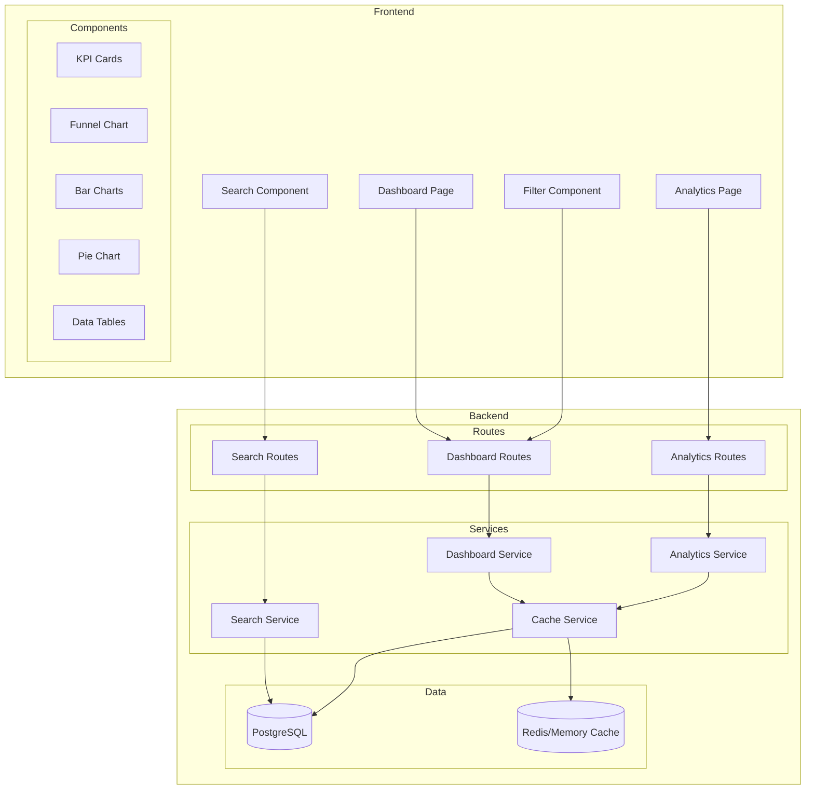

# Design Document: Dashboard, Analytics & Company Reporting

## Overview

This design document outlines the technical architecture for Phase 4 of the ATS system - Dashboard, Analytics & Company Reporting. The system will provide comprehensive analytics capabilities, an enhanced dashboard with real-time metrics, advanced search and filtering functionality, and detailed reporting modules.

The design follows a layered architecture with:
- **Backend Analytics Services**: Calculate and aggregate metrics from the database
- **REST API Endpoints**: Expose analytics data to the frontend
- **Frontend Components**: Visualize data using charts, tables, and KPI cards
- **Caching Layer**: Optimize performance for frequently accessed metrics

## Architecture



## Components and Interfaces

### Backend Services

#### 1. Analytics Service (`analytics.service.ts`)

```typescript
interface AnalyticsService {
  // KPI Metrics
  getKPIMetrics(companyId: string, filters: AnalyticsFilters): Promise<KPIMetrics>;
  
  // Funnel Analytics
  getFunnelAnalytics(companyId: string, filters: AnalyticsFilters): Promise<FunnelData>;
  getConversionRates(companyId: string, filters: AnalyticsFilters): Promise<ConversionData>;
  
  // Time Analytics
  getTimeToFill(companyId: string, filters: AnalyticsFilters): Promise<TimeToFillData>;
  getTimeInStage(companyId: string, filters: AnalyticsFilters): Promise<TimeInStageData>;
  
  // Source Analytics
  getSourcePerformance(companyId: string, filters: AnalyticsFilters): Promise<SourceData[]>;
  
  // Team Performance
  getRecruiterProductivity(companyId: string, filters: AnalyticsFilters): Promise<RecruiterData[]>;
  getPanelPerformance(companyId: string, filters: AnalyticsFilters): Promise<PanelData[]>;
  
  // Drop-off Analysis
  getDropOffAnalysis(companyId: string, filters: AnalyticsFilters): Promise<DropOffData>;
  getRejectionReasons(companyId: string, filters: AnalyticsFilters): Promise<RejectionData>;
  
  // Offer Analytics
  getOfferAcceptanceRate(companyId: string, filters: AnalyticsFilters): Promise<OfferData>;
  
  // SLA Analytics
  getSLAStatus(companyId: string, filters: AnalyticsFilters): Promise<SLAStatusData>;
}

interface AnalyticsFilters {
  startDate?: Date;
  endDate?: Date;
  departmentId?: string;
  locationId?: string;
  jobId?: string;
  recruiterId?: string;
}
```

#### 2. Dashboard Service (`dashboard.service.ts`)

```typescript
interface DashboardService {
  // Aggregated dashboard data
  getDashboardData(companyId: string, userId: string, role: UserRole): Promise<DashboardData>;
  
  // Role pipeline
  getRolePipeline(companyId: string, userId: string, role: UserRole): Promise<RolePipeline[]>;
  
  // Activity feed
  getActivityFeed(companyId: string, limit: number): Promise<ActivityEntry[]>;
  
  // Upcoming interviews
  getUpcomingInterviews(companyId: string, userId: string, period: 'today' | 'week'): Promise<Interview[]>;
}
```

#### 3. Search Service (`search.service.ts`)

```typescript
interface SearchService {
  // Candidate search with Boolean support
  searchCandidates(companyId: string, query: SearchQuery): Promise<SearchResult<Candidate>>;
  
  // Job search
  searchJobs(companyId: string, query: SearchQuery): Promise<SearchResult<Job>>;
  
  // Parse Boolean query
  parseBooleanQuery(queryString: string): ParsedQuery;
}

interface SearchQuery {
  query: string;
  filters: SearchFilters;
  page: number;
  pageSize: number;
  sortBy?: string;
  sortOrder?: 'asc' | 'desc';
}

interface SearchFilters {
  stage?: string[];
  dateRange?: { start: Date; end: Date };
  location?: string[];
  source?: string[];
  experienceMin?: number;
  experienceMax?: number;
  skills?: string[];
}
```

### API Endpoints

#### Dashboard Routes (`/api/dashboard`)

| Method | Endpoint | Description |
|--------|----------|-------------|
| GET | `/api/dashboard` | Get aggregated dashboard data |
| GET | `/api/dashboard/kpis` | Get KPI metrics |
| GET | `/api/dashboard/pipeline` | Get role pipeline data |
| GET | `/api/dashboard/interviews` | Get upcoming interviews |
| GET | `/api/dashboard/activity` | Get activity feed |

#### Analytics Routes (`/api/analytics`)

| Method | Endpoint | Description |
|--------|----------|-------------|
| GET | `/api/analytics/funnel` | Get funnel analytics |
| GET | `/api/analytics/time-to-fill` | Get time-to-fill metrics |
| GET | `/api/analytics/time-in-stage` | Get time-in-stage metrics |
| GET | `/api/analytics/sources` | Get source performance |
| GET | `/api/analytics/recruiters` | Get recruiter productivity |
| GET | `/api/analytics/panels` | Get panel performance |
| GET | `/api/analytics/drop-off` | Get drop-off analysis |
| GET | `/api/analytics/offer-rate` | Get offer acceptance rate |
| GET | `/api/analytics/sla` | Get SLA status summary |
| GET | `/api/analytics/export` | Export analytics report |

#### Search Routes (`/api/search`)

| Method | Endpoint | Description |
|--------|----------|-------------|
| GET | `/api/search/candidates` | Search candidates |
| GET | `/api/search/jobs` | Search jobs |

### Frontend Components

#### 1. KPI Card Component

```typescript
interface KPICardProps {
  title: string;
  value: number | string;
  subtitle?: string;
  trend?: {
    value: number;
    direction: 'up' | 'down';
    isPositive: boolean;
  };
  icon?: React.ReactNode;
  loading?: boolean;
}
```

#### 2. Funnel Chart Component

```typescript
interface FunnelChartProps {
  stages: FunnelStage[];
  onStageClick?: (stage: FunnelStage) => void;
  showPercentages?: boolean;
  colorScheme?: string[];
}

interface FunnelStage {
  name: string;
  count: number;
  percentage: number;
  conversionRate?: number;
}
```

#### 3. Analytics Filter Component

```typescript
interface AnalyticsFilterProps {
  filters: AnalyticsFilters;
  onFilterChange: (filters: AnalyticsFilters) => void;
  availableFilters: {
    departments: Option[];
    locations: Option[];
    jobs: Option[];
    dateRanges: DateRangeOption[];
  };
}
```

#### 4. Search Input Component

```typescript
interface SearchInputProps {
  value: string;
  onChange: (value: string) => void;
  onSearch: (query: string) => void;
  placeholder?: string;
  suggestions?: string[];
  showBooleanHelp?: boolean;
}
```

## Data Models

### KPI Metrics

```typescript
interface KPIMetrics {
  activeRoles: number;
  activeCandidates: number;
  interviewsToday: number;
  interviewsThisWeek: number;
  offersPending: number;
  totalHires: number;
  avgTimeToFill: number;
  offerAcceptanceRate: number;
  rolesOnTrack: number;
  rolesAtRisk: number;
  rolesBreached: number;
}
```

### Funnel Data

```typescript
interface FunnelData {
  stages: FunnelStage[];
  totalApplicants: number;
  totalHired: number;
  overallConversionRate: number;
}

interface FunnelStage {
  id: string;
  name: string;
  count: number;
  percentage: number;
  conversionToNext: number;
  avgDaysInStage: number;
}
```

### Time Analytics

```typescript
interface TimeToFillData {
  overall: {
    average: number;
    median: number;
    target: number;
  };
  byDepartment: {
    department: string;
    average: number;
    count: number;
  }[];
  byRole: {
    roleId: string;
    roleName: string;
    average: number;
    isOverTarget: boolean;
  }[];
}

interface TimeInStageData {
  stages: {
    stageName: string;
    avgDays: number;
    isBottleneck: boolean;
  }[];
  bottleneckStage: string;
  suggestion: string;
}
```

### Source Performance

```typescript
interface SourceData {
  source: string;
  candidateCount: number;
  percentage: number;
  hireCount: number;
  hireRate: number;
  avgTimeToHire: number;
}
```

### Team Performance

```typescript
interface RecruiterData {
  id: string;
  name: string;
  specialty: string;
  activeRoles: number;
  cvsAdded: number;
  interviewsScheduled: number;
  offersMade: number;
  hires: number;
  avgTimeToFill: number;
  productivityScore: number;
}

interface PanelData {
  panelName: string;
  interviewRounds: number;
  offerPercentage: number;
  topRejectionReason: string;
  avgFeedbackTime: number;
}
```

### Drop-off Analysis

```typescript
interface DropOffData {
  byStage: {
    stageName: string;
    dropOffCount: number;
    dropOffPercentage: number;
  }[];
  highestDropOffStage: string;
}

interface RejectionData {
  reasons: {
    reason: string;
    count: number;
    percentage: number;
    color: string;
  }[];
  topStageForRejection: string;
}
```

### SLA Status

```typescript
interface SLAStatusData {
  summary: {
    onTrack: number;
    atRisk: number;
    breached: number;
  };
  roles: {
    roleId: string;
    roleName: string;
    status: 'on_track' | 'at_risk' | 'breached';
    daysOpen: number;
    threshold: number;
    candidatesBreaching: number;
  }[];
}
```

### Search Result

```typescript
interface SearchResult<T> {
  items: T[];
  total: number;
  page: number;
  pageSize: number;
  totalPages: number;
  highlights: Map<string, string[]>;
}

interface ParsedQuery {
  terms: string[];
  operators: ('AND' | 'OR' | 'NOT')[];
  isValid: boolean;
  error?: string;
}
```

## Error Handling

### Error Types

```typescript
enum AnalyticsErrorCode {
  INVALID_DATE_RANGE = 'INVALID_DATE_RANGE',
  INSUFFICIENT_DATA = 'INSUFFICIENT_DATA',
  EXPORT_FAILED = 'EXPORT_FAILED',
  SEARCH_QUERY_INVALID = 'SEARCH_QUERY_INVALID',
  FILTER_INVALID = 'FILTER_INVALID',
}

interface AnalyticsError {
  code: AnalyticsErrorCode;
  message: string;
  details?: Record<string, unknown>;
}
```

### Error Handling Strategy

1. **Invalid Date Range**: Return 400 with clear message about valid date ranges
2. **Insufficient Data**: Return empty results with metadata indicating no data available
3. **Export Failed**: Return 500 with retry suggestion
4. **Invalid Search Query**: Return 400 with parsed query error details
5. **Invalid Filters**: Return 400 with list of invalid filter values

## Testing Strategy

### Unit Tests

Unit tests will cover:
- Analytics calculation functions (time-to-fill, conversion rates, etc.)
- Boolean query parser
- Filter validation logic
- Data transformation functions
- KPI aggregation logic

### Property-Based Tests

Property-based tests will verify:
- Funnel percentages always sum correctly
- Time calculations are always non-negative
- Search results match filter criteria
- Conversion rates are between 0 and 100
- Export data matches displayed data

### Integration Tests

Integration tests will cover:
- Dashboard API endpoints return correct data structure
- Analytics filters work correctly with database queries
- Search functionality returns relevant results
- Export generates valid PDF/Excel files


## Correctness Properties

*A property is a characteristic or behavior that should hold true across all valid executions of a system—essentially, a formal statement about what the system should do. Properties serve as the bridge between human-readable specifications and machine-verifiable correctness guarantees.*

Based on the acceptance criteria analysis, the following correctness properties have been identified for property-based testing:

### Property 1: Role-based Data Filtering

*For any* user with recruiter role and any set of jobs, the dashboard KPI metrics and role pipeline SHALL only include data from jobs where the user is the assigned recruiter.

**Validates: Requirements 1.2, 1.3, 3.7, 11.5**

### Property 2: KPI Data Completeness

*For any* valid dashboard request, the returned KPI metrics SHALL contain all required fields: activeRoles, activeCandidates, interviewsToday, interviewsThisWeek, offersPending, totalHires, avgTimeToFill, and offerAcceptanceRate, with each field being a non-negative number.

**Validates: Requirements 1.1, 1.4**

### Property 3: Funnel Data Correctness

*For any* set of candidates in a pipeline, the funnel data SHALL satisfy:
- Each stage count is non-negative
- Stage percentages are between 0 and 100
- The first stage percentage is always 100%
- Each subsequent stage percentage is less than or equal to the previous stage
- Conversion rates between stages are calculated as (next_stage_count / current_stage_count) * 100

**Validates: Requirements 2.1, 2.2, 2.5, 9.1, 9.2**

### Property 4: Role Pipeline Data Completeness

*For any* role pipeline query, each returned role SHALL contain: id, role name, location, applicant count, interview count, offer count, age (days), SLA status (one of 'On track', 'At risk', 'Breached'), and priority (one of 'High', 'Medium', 'Low').

**Validates: Requirements 3.1, 3.2**

### Property 5: Role Pipeline Limiting and Ranking

*For any* role pipeline query, the returned roles SHALL be limited to at most 7 roles, and they SHALL be sorted by a relevance score that prioritizes roles with higher priority and worse SLA status.

**Validates: Requirements 3.5**

### Property 6: Sorting Correctness

*For any* sortable data set (roles, interviews, recruiters, activities) and any sort field, sorting in ascending order SHALL produce results where each element's sort field value is less than or equal to the next element's value, and sorting in descending order SHALL produce the reverse.

**Validates: Requirements 3.3, 4.1, 5.4, 11.3, 20.1**

### Property 7: Interview Data Completeness and Limiting

*For any* interview query, each returned interview SHALL contain: id, time, candidate name, role, panel members, and meeting type. The results SHALL be limited to at most 5 interviews and sorted chronologically by scheduled time.

**Validates: Requirements 4.2, 4.4**

### Property 8: Interview Period Filtering

*For any* interview query with period filter, when period is 'today' the results SHALL only include interviews scheduled for the current date, and when period is 'week' the results SHALL only include interviews scheduled within the current week.

**Validates: Requirements 4.6**

### Property 9: Source Analytics Completeness

*For any* source analytics query, each returned source SHALL contain: source name, candidate count, and percentage. The percentages across all sources SHALL sum to 100% (within floating point tolerance). Sources with zero candidates SHALL be excluded from results.

**Validates: Requirements 5.1, 5.2, 5.5, 5.6**

### Property 10: Source Ranking by Effectiveness

*For any* source analytics query, sources SHALL be ranked by hire rate (hires / candidates), not by volume, in descending order.

**Validates: Requirements 5.4**

### Property 11: Time-to-Fill Calculation Correctness

*For any* set of closed jobs with hire dates, the average time-to-fill SHALL be calculated as the mean of (hire_date - job_created_date) in days for all closed jobs. The result SHALL be a non-negative number.

**Validates: Requirements 6.1, 6.2, 6.3**

### Property 12: Time-to-Fill Target Highlighting

*For any* role with time-to-fill data and a configured target threshold, the role SHALL be flagged as 'over target' if and only if its time-to-fill exceeds the target threshold.

**Validates: Requirements 6.4, 6.6**

### Property 13: Time-in-Stage Calculation and Bottleneck Identification

*For any* set of stage history records, the average time-in-stage for each stage SHALL be calculated as the mean of all duration values for that stage. The bottleneck stage SHALL be the stage with the highest average time-in-stage.

**Validates: Requirements 7.1, 7.2, 7.3, 7.4**

### Property 14: Offer Acceptance Rate Calculation

*For any* set of offers, the offer acceptance rate SHALL be calculated as (accepted_offers / total_offers) * 100. The result SHALL be between 0 and 100.

**Validates: Requirements 8.1, 8.2, 8.3, 8.4**

### Property 15: Threshold-based Warning Indicators

*For any* metric with a configured threshold:
- Offer acceptance rate below 70% SHALL trigger a warning
- Conversion rate below 20% between stages SHALL be highlighted as a concern
- Roles within 3 days of SLA breach SHALL be marked as 'At risk'
- Roles past SLA threshold SHALL be marked as 'Breached'

**Validates: Requirements 8.5, 9.6, 19.3, 19.4**

### Property 16: Drop-off Analysis Correctness

*For any* pipeline with candidates, the drop-off count for each stage SHALL equal the number of candidates who exited the pipeline at that stage. Drop-off percentages SHALL be calculated as (drop_off_count / total_candidates_who_reached_stage) * 100.

**Validates: Requirements 10.1, 10.3**

### Property 17: Rejection Reason Categorization

*For any* set of rejection reasons, they SHALL be grouped into exactly four categories: 'Skill mismatch', 'Compensation mismatch', 'Culture fit', and 'Location/notice/other'. The percentages across categories SHALL sum to 100%.

**Validates: Requirements 10.2, 10.5**

### Property 18: Recruiter Productivity Data Completeness

*For any* recruiter productivity query, each returned recruiter SHALL contain: id, name, specialty, activeRoles, cvsAdded, interviewsScheduled, offersMade, hires, and avgTimeToFill. All numeric fields SHALL be non-negative.

**Validates: Requirements 11.1, 11.2**

### Property 19: Panel Performance Data Completeness

*For any* panel performance query, each returned panel SHALL contain: panelName, interviewRounds, offerPercentage, topRejectionReason, and avgFeedbackTime. Offer percentage SHALL be between 0 and 100.

**Validates: Requirements 12.1, 12.2, 12.3, 12.4**

### Property 20: Boolean Search Query Parsing

*For any* search query string containing Boolean operators (AND, OR, NOT), the parser SHALL correctly identify all terms and operators. The parsed query SHALL be executable and return results that match the Boolean logic.

**Validates: Requirements 13.2**

### Property 21: Search Result Matching

*For any* search query and candidate database, all returned candidates SHALL match at least one of the search criteria. For partial match fields (name, email), results SHALL include candidates where the field contains the search term as a substring.

**Validates: Requirements 13.1, 13.4, 13.5**

### Property 22: Filter Combination Logic

*For any* set of filters applied simultaneously, the results SHALL only include items that match ALL applied filters (AND logic). The active filter count SHALL equal the number of non-empty filter values.

**Validates: Requirements 14.1, 14.2, 14.3, 14.5**

### Property 23: Date Range Filtering

*For any* analytics query with a date range filter, all returned data SHALL fall within the specified date range (inclusive of start and end dates).

**Validates: Requirements 15.1, 15.2, 15.3**

### Property 24: Export Data Consistency

*For any* analytics export, the exported data SHALL contain all data that was visible in the UI at the time of export, including the selected date range and active filters as metadata.

**Validates: Requirements 16.3, 16.4**

### Property 25: SLA Status Calculation

*For any* role with candidates, the SLA status SHALL be calculated based on the configured threshold for the company. A role is 'On track' if all candidates are within threshold, 'At risk' if any candidate is within 3 days of threshold, and 'Breached' if any candidate exceeds threshold.

**Validates: Requirements 19.1, 19.2**

### Property 26: Activity Feed Ordering and Limiting

*For any* activity feed query, activities SHALL be sorted in reverse chronological order (newest first) and limited to at most 10 entries. Each activity SHALL contain: id, timestamp, description, and related entity reference.

**Validates: Requirements 20.1, 20.2, 20.3, 20.4**
