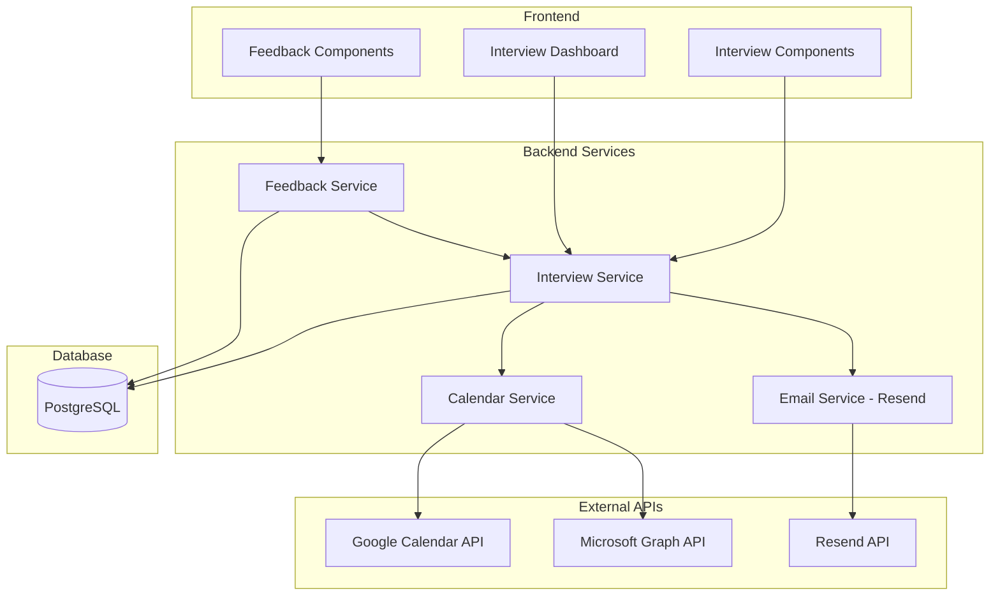

# Design Document: Interview Management & Scheduling System

## Overview

This design document outlines the architecture and implementation details for Phase 3 of the ATS platform - the Interview Management & Scheduling System. The system integrates with Google Calendar API (for Google Meet), Microsoft Graph API (for Outlook Calendar and Teams meetings), and Resend API for email notifications.

### Key Integrations

| Integration | API | Purpose |
|-------------|-----|---------|
| Google Calendar | Google Calendar API v3 | Calendar sync + Google Meet link generation |
| Microsoft Outlook | Microsoft Graph API | Outlook calendar sync + Teams meeting links |
| Email Service | Resend API | Transactional emails (confirmations, reminders) |

## Architecture



## Components and Interfaces

### 1. Interview Service (`backend/src/services/interview.service.ts`)

The core service managing interview CRUD operations.

```typescript
interface InterviewService {
  // Create a new interview
  createInterview(data: CreateInterviewInput): Promise<Interview>;
  
  // Update/reschedule an interview
  updateInterview(id: string, data: UpdateInterviewInput): Promise<Interview>;
  
  // Cancel an interview
  cancelInterview(id: string, reason?: string): Promise<Interview>;
  
  // Get interview by ID
  getInterview(id: string): Promise<Interview | null>;
  
  // List interviews with filters
  listInterviews(filters: InterviewFilters): Promise<Interview[]>;
  
  // Get interviews for dashboard (today, tomorrow, this week)
  getDashboardInterviews(userId: string, companyId: string): Promise<DashboardInterviews>;
  
  // Get panel load distribution
  getPanelLoadDistribution(companyId: string, period: 'week' | 'month'): Promise<PanelLoad[]>;
}

interface CreateInterviewInput {
  jobCandidateId: string;
  scheduledAt: Date;          // UTC timestamp
  duration: number;           // minutes
  timezone: string;           // IANA timezone (e.g., 'Asia/Kolkata')
  mode: 'google_meet' | 'microsoft_teams' | 'in_person';
  location?: string;          // Required for in_person
  panelMemberIds: string[];   // User IDs of interviewers
  notes?: string;
  scheduledBy: string;        // User ID
}

interface UpdateInterviewInput {
  scheduledAt?: Date;
  duration?: number;
  timezone?: string;
  mode?: 'google_meet' | 'microsoft_teams' | 'in_person';
  location?: string;
  panelMemberIds?: string[];
  notes?: string;
}

interface InterviewFilters {
  companyId: string;
  jobId?: string;
  candidateId?: string;
  panelMemberId?: string;
  status?: InterviewStatus;
  dateFrom?: Date;
  dateTo?: Date;
  mode?: InterviewMode;
}
```

### 2. Calendar Integration Service (`backend/src/services/calendar.service.ts`)

Handles OAuth and calendar event management for Google and Microsoft.

```typescript
interface CalendarService {
  // OAuth flow
  getGoogleAuthUrl(userId: string, redirectUri: string): string;
  handleGoogleCallback(userId: string, code: string): Promise<void>;
  
  getMicrosoftAuthUrl(userId: string, redirectUri: string): string;
  handleMicrosoftCallback(userId: string, code: string): Promise<void>;
  
  // Calendar operations
  createCalendarEvent(interview: Interview, userId: string): Promise<CalendarEventResult>;
  updateCalendarEvent(interview: Interview, userId: string): Promise<CalendarEventResult>;
  deleteCalendarEvent(interview: Interview, userId: string): Promise<void>;
  
  // Meeting link generation
  generateGoogleMeetLink(interview: Interview): Promise<string>;
  generateTeamsMeetingLink(interview: Interview): Promise<string>;
}

interface CalendarEventResult {
  provider: 'google' | 'microsoft';
  eventId: string;
  meetingLink?: string;
}

// Google Calendar API configuration
const GOOGLE_CALENDAR_SCOPES = [
  'https://www.googleapis.com/auth/calendar.events',
  'https://www.googleapis.com/auth/calendar.readonly'
];

// Microsoft Graph API configuration
const MICROSOFT_GRAPH_SCOPES = [
  'Calendars.ReadWrite',
  'OnlineMeetings.ReadWrite'
];
```

### 3. Email Service with Resend (`backend/src/services/email.service.ts`)

Handles all transactional emails using Resend API.

```typescript
import { Resend } from 'resend';

interface EmailService {
  // Interview emails
  sendInterviewConfirmation(interview: Interview, recipient: 'candidate' | 'panel'): Promise<void>;
  sendInterviewReschedule(interview: Interview, oldTime: Date): Promise<void>;
  sendInterviewCancellation(interview: Interview, reason?: string): Promise<void>;
  sendInterviewReminder(interview: Interview, recipient: 'candidate' | 'panel'): Promise<void>;
  
  // Feedback emails
  sendFeedbackReminder(interview: Interview, panelMember: User): Promise<void>;
}

// Resend configuration
const resend = new Resend(process.env.RESEND_API_KEY);

// Email template types
type EmailTemplate = 
  | 'interview_confirmation_candidate'
  | 'interview_confirmation_panel'
  | 'interview_reschedule'
  | 'interview_cancellation'
  | 'interview_reminder_candidate'
  | 'interview_reminder_panel'
  | 'feedback_reminder';
```

### 4. Feedback Service (`backend/src/services/feedback.service.ts`)

Manages interview feedback and scorecards.

```typescript
interface FeedbackService {
  // Submit feedback
  submitFeedback(data: SubmitFeedbackInput): Promise<InterviewFeedback>;
  
  // Get feedback for an interview
  getInterviewFeedback(interviewId: string): Promise<InterviewFeedback[]>;
  
  // Check if all feedback is complete
  isAllFeedbackComplete(interviewId: string): Promise<boolean>;
  
  // Process auto-stage movement
  processAutoStageMovement(interviewId: string): Promise<void>;
  
  // Get pending feedback for a user
  getPendingFeedback(userId: string): Promise<Interview[]>;
}

interface SubmitFeedbackInput {
  interviewId: string;
  panelMemberId: string;
  ratings: FeedbackRating[];
  overallComments: string;
  recommendation: 'strong_hire' | 'hire' | 'no_hire' | 'strong_no_hire';
}

interface FeedbackRating {
  criterion: string;      // e.g., 'technical_skills', 'communication'
  score: number;          // 1-5
  comments?: string;
}
```

## Data Models

### Database Schema Extensions

```prisma
// Interview Mode Enum
enum InterviewMode {
  google_meet
  microsoft_teams
  in_person

  @@map("interview_mode")
}

// Interview Status Enum
enum InterviewStatus {
  scheduled
  in_progress
  completed
  cancelled
  no_show

  @@map("interview_status")
}

// Recommendation Enum
enum InterviewRecommendation {
  strong_hire
  hire
  no_hire
  strong_no_hire

  @@map("interview_recommendation")
}

// Main Interview Model
model Interview {
  id              String           @id @default(uuid())
  jobCandidateId  String           @map("job_candidate_id")
  scheduledAt     DateTime         @map("scheduled_at")
  duration        Int              // minutes
  timezone        String           @default("UTC")
  mode            InterviewMode
  meetingLink     String?          @map("meeting_link")
  location        String?
  status          InterviewStatus  @default(scheduled)
  notes           String?          @db.Text
  cancelReason    String?          @map("cancel_reason") @db.Text
  scheduledBy     String           @map("scheduled_by")
  createdAt       DateTime         @default(now()) @map("created_at")
  updatedAt       DateTime         @updatedAt @map("updated_at")

  jobCandidate    JobCandidate     @relation(fields: [jobCandidateId], references: [id], onDelete: Cascade)
  scheduler       User             @relation("InterviewScheduler", fields: [scheduledBy], references: [id])
  panelMembers    InterviewPanel[]
  feedback        InterviewFeedback[]
  calendarEvents  CalendarEvent[]

  @@index([jobCandidateId])
  @@index([scheduledAt])
  @@index([status])
  @@map("interviews")
}

// Interview Panel (Many-to-Many: Interview <-> User)
model InterviewPanel {
  id           String    @id @default(uuid())
  interviewId  String    @map("interview_id")
  userId       String    @map("user_id")
  createdAt    DateTime  @default(now()) @map("created_at")

  interview    Interview @relation(fields: [interviewId], references: [id], onDelete: Cascade)
  user         User      @relation(fields: [userId], references: [id])

  @@unique([interviewId, userId])
  @@map("interview_panels")
}

// Interview Feedback/Scorecard
model InterviewFeedback {
  id              String                   @id @default(uuid())
  interviewId     String                   @map("interview_id")
  panelMemberId   String                   @map("panel_member_id")
  ratings         Json                     // Array of {criterion, score, comments}
  overallComments String                   @map("overall_comments") @db.Text
  recommendation  InterviewRecommendation
  submittedAt     DateTime                 @default(now()) @map("submitted_at")

  interview       Interview                @relation(fields: [interviewId], references: [id], onDelete: Cascade)
  panelMember     User                     @relation("FeedbackAuthor", fields: [panelMemberId], references: [id])

  @@unique([interviewId, panelMemberId])
  @@index([interviewId])
  @@map("interview_feedback")
}

// Calendar Event Sync Tracking
model CalendarEvent {
  id           String    @id @default(uuid())
  interviewId  String    @map("interview_id")
  userId       String    @map("user_id")
  provider     String    // 'google' or 'microsoft'
  externalId   String    @map("external_id")
  createdAt    DateTime  @default(now()) @map("created_at")

  interview    Interview @relation(fields: [interviewId], references: [id], onDelete: Cascade)
  user         User      @relation("UserCalendarEvents", fields: [userId], references: [id])

  @@unique([interviewId, userId, provider])
  @@map("calendar_events")
}

// OAuth Token Storage
model OAuthToken {
  id           String    @id @default(uuid())
  userId       String    @map("user_id")
  provider     String    // 'google' or 'microsoft'
  accessToken  String    @map("access_token") @db.Text
  refreshToken String?   @map("refresh_token") @db.Text
  expiresAt    DateTime  @map("expires_at")
  scope        String?
  createdAt    DateTime  @default(now()) @map("created_at")
  updatedAt    DateTime  @updatedAt @map("updated_at")

  user         User      @relation(fields: [userId], references: [id], onDelete: Cascade)

  @@unique([userId, provider])
  @@map("oauth_tokens")
}

// Email Template Storage
model EmailTemplate {
  id          String    @id @default(uuid())
  companyId   String?   @map("company_id")  // null = system default
  templateKey String    @map("template_key")
  subject     String
  htmlContent String    @map("html_content") @db.Text
  createdAt   DateTime  @default(now()) @map("created_at")
  updatedAt   DateTime  @updatedAt @map("updated_at")

  company     Company?  @relation(fields: [companyId], references: [id], onDelete: Cascade)

  @@unique([companyId, templateKey])
  @@map("email_templates")
}

// Scorecard Template
model ScorecardTemplate {
  id          String    @id @default(uuid())
  companyId   String    @map("company_id")
  name        String
  criteria    Json      // Array of {name, description, weight}
  isDefault   Boolean   @default(false) @map("is_default")
  createdAt   DateTime  @default(now()) @map("created_at")
  updatedAt   DateTime  @updatedAt @map("updated_at")

  company     Company   @relation(fields: [companyId], references: [id], onDelete: Cascade)

  @@map("scorecard_templates")
}

// Company Settings Extension
model CompanySettings {
  id                      String   @id @default(uuid())
  companyId               String   @unique @map("company_id")
  autoStageMovementEnabled Boolean @default(true) @map("auto_stage_movement_enabled")
  feedbackReminderHours   Int      @default(24) @map("feedback_reminder_hours")
  preferredCalendarProvider String? @map("preferred_calendar_provider")
  createdAt               DateTime @default(now()) @map("created_at")
  updatedAt               DateTime @updatedAt @map("updated_at")

  company                 Company  @relation(fields: [companyId], references: [id], onDelete: Cascade)

  @@map("company_settings")
}
```

### User Model Extensions

```prisma
// Add to existing User model
model User {
  // ... existing fields ...
  
  // Phase 3 relations
  scheduledInterviews  Interview[]         @relation("InterviewScheduler")
  interviewPanels      InterviewPanel[]
  interviewFeedback    InterviewFeedback[] @relation("FeedbackAuthor")
  calendarEvents       CalendarEvent[]     @relation("UserCalendarEvents")
  oauthTokens          OAuthToken[]
}
```

## API Endpoints

### Interview Routes (`backend/src/routes/interview.routes.ts`)

```typescript
// Interview CRUD
POST   /api/interviews                    // Create interview
GET    /api/interviews                    // List interviews (with filters)
GET    /api/interviews/:id                // Get interview details
PUT    /api/interviews/:id                // Update/reschedule interview
DELETE /api/interviews/:id                // Cancel interview

// Dashboard endpoints
GET    /api/interviews/dashboard          // Get dashboard data (today, tomorrow, week)
GET    /api/interviews/panel-load         // Get panel load distribution

// Feedback endpoints
POST   /api/interviews/:id/feedback       // Submit feedback
GET    /api/interviews/:id/feedback       // Get all feedback for interview
GET    /api/interviews/pending-feedback   // Get interviews pending user's feedback

// Calendar OAuth endpoints
GET    /api/calendar/google/auth          // Get Google OAuth URL
GET    /api/calendar/google/callback      // Handle Google OAuth callback
GET    /api/calendar/microsoft/auth       // Get Microsoft OAuth URL
GET    /api/calendar/microsoft/callback   // Handle Microsoft OAuth callback
DELETE /api/calendar/:provider/disconnect // Disconnect calendar integration

// Email template endpoints
GET    /api/email-templates               // List email templates
PUT    /api/email-templates/:key          // Update email template

// Scorecard template endpoints
GET    /api/scorecard-templates           // List scorecard templates
POST   /api/scorecard-templates           // Create scorecard template
PUT    /api/scorecard-templates/:id       // Update scorecard template
DELETE /api/scorecard-templates/:id       // Delete scorecard template
```

## External API Integration Details

### Google Calendar API Integration

```typescript
// Google OAuth2 Configuration
const googleOAuth2Client = new google.auth.OAuth2(
  process.env.GOOGLE_CLIENT_ID,
  process.env.GOOGLE_CLIENT_SECRET,
  process.env.GOOGLE_REDIRECT_URI
);

// Create calendar event with Google Meet
async function createGoogleCalendarEvent(interview: Interview, tokens: OAuthToken): Promise<CalendarEventResult> {
  const calendar = google.calendar({ version: 'v3', auth: googleOAuth2Client });
  
  const event = {
    summary: `Interview: ${interview.candidate.name} - ${interview.job.title}`,
    description: buildEventDescription(interview),
    start: {
      dateTime: interview.scheduledAt.toISOString(),
      timeZone: interview.timezone,
    },
    end: {
      dateTime: addMinutes(interview.scheduledAt, interview.duration).toISOString(),
      timeZone: interview.timezone,
    },
    attendees: interview.panelMembers.map(pm => ({ email: pm.email })),
    conferenceData: {
      createRequest: {
        requestId: interview.id,
        conferenceSolutionKey: { type: 'hangoutsMeet' }
      }
    }
  };

  const response = await calendar.events.insert({
    calendarId: 'primary',
    resource: event,
    conferenceDataVersion: 1,
    sendUpdates: 'all'
  });

  return {
    provider: 'google',
    eventId: response.data.id!,
    meetingLink: response.data.conferenceData?.entryPoints?.[0]?.uri
  };
}
```

### Microsoft Graph API Integration

```typescript
// Microsoft OAuth2 Configuration
const msalConfig = {
  auth: {
    clientId: process.env.MICROSOFT_CLIENT_ID!,
    clientSecret: process.env.MICROSOFT_CLIENT_SECRET!,
    authority: `https://login.microsoftonline.com/${process.env.MICROSOFT_TENANT_ID}`
  }
};

// Create Outlook calendar event with Teams meeting
async function createOutlookCalendarEvent(interview: Interview, tokens: OAuthToken): Promise<CalendarEventResult> {
  const client = Client.init({
    authProvider: (done) => done(null, tokens.accessToken)
  });

  const event = {
    subject: `Interview: ${interview.candidate.name} - ${interview.job.title}`,
    body: {
      contentType: 'HTML',
      content: buildEventDescription(interview)
    },
    start: {
      dateTime: interview.scheduledAt.toISOString(),
      timeZone: interview.timezone
    },
    end: {
      dateTime: addMinutes(interview.scheduledAt, interview.duration).toISOString(),
      timeZone: interview.timezone
    },
    attendees: interview.panelMembers.map(pm => ({
      emailAddress: { address: pm.email, name: pm.name },
      type: 'required'
    })),
    isOnlineMeeting: true,
    onlineMeetingProvider: 'teamsForBusiness'
  };

  const response = await client.api('/me/events').post(event);

  return {
    provider: 'microsoft',
    eventId: response.id,
    meetingLink: response.onlineMeeting?.joinUrl
  };
}
```

### Resend Email Integration

```typescript
import { Resend } from 'resend';

const resend = new Resend(process.env.RESEND_API_KEY);

// Send interview confirmation to candidate
async function sendInterviewConfirmationToCandidate(interview: Interview): Promise<void> {
  const template = await getEmailTemplate('interview_confirmation_candidate', interview.company.id);
  
  const html = renderTemplate(template.htmlContent, {
    candidate_name: interview.candidate.name,
    job_title: interview.job.title,
    interview_date: formatDate(interview.scheduledAt, interview.timezone),
    interview_time: formatTime(interview.scheduledAt, interview.timezone),
    duration: `${interview.duration} minutes`,
    meeting_link: interview.meetingLink || interview.location,
    interviewer_names: interview.panelMembers.map(pm => pm.name).join(', '),
    company_name: interview.company.name
  });

  await resend.emails.send({
    from: `${interview.company.name} <noreply@${process.env.RESEND_DOMAIN}>`,
    to: interview.candidate.email,
    subject: renderTemplate(template.subject, { job_title: interview.job.title }),
    html
  });
}

// Send interview invitation to panel members
async function sendInterviewInvitationToPanel(interview: Interview): Promise<void> {
  const template = await getEmailTemplate('interview_confirmation_panel', interview.company.id);
  
  for (const panelMember of interview.panelMembers) {
    const html = renderTemplate(template.htmlContent, {
      interviewer_name: panelMember.name,
      candidate_name: interview.candidate.name,
      job_title: interview.job.title,
      interview_date: formatDate(interview.scheduledAt, panelMember.timezone || interview.timezone),
      interview_time: formatTime(interview.scheduledAt, panelMember.timezone || interview.timezone),
      duration: `${interview.duration} minutes`,
      meeting_link: interview.meetingLink || interview.location,
      resume_link: interview.candidate.resumeUrl,
      company_name: interview.company.name
    });

    await resend.emails.send({
      from: `${interview.company.name} <noreply@${process.env.RESEND_DOMAIN}>`,
      to: panelMember.email,
      subject: renderTemplate(template.subject, { 
        candidate_name: interview.candidate.name,
        job_title: interview.job.title 
      }),
      html
    });
  }
}
```

## Frontend Components

### Interview Scheduling Modal

```typescript
// frontend/src/components/InterviewScheduleModal.tsx
interface InterviewScheduleModalProps {
  jobCandidateId: string;
  candidateName: string;
  jobTitle: string;
  onClose: () => void;
  onSuccess: (interview: Interview) => void;
}

interface InterviewFormData {
  scheduledAt: string;        // ISO datetime
  duration: number;           // 30, 45, 60, 90 minutes
  timezone: string;
  mode: 'google_meet' | 'microsoft_teams' | 'in_person';
  location?: string;
  panelMemberIds: string[];
  notes?: string;
}
```

### Interview Dashboard Page

```typescript
// frontend/src/pages/InterviewDashboardPage.tsx
interface DashboardData {
  today: Interview[];
  tomorrow: Interview[];
  thisWeek: Interview[];
  pendingFeedback: Interview[];
  panelLoad: PanelLoadData[];
}

interface PanelLoadData {
  userId: string;
  userName: string;
  interviewCount: number;
  averageLoad: number;
}
```

### Feedback Scorecard Component

```typescript
// frontend/src/components/FeedbackScorecard.tsx
interface FeedbackScorecardProps {
  interview: Interview;
  onSubmit: (feedback: FeedbackSubmission) => void;
}

interface FeedbackSubmission {
  ratings: Array<{
    criterion: string;
    score: 1 | 2 | 3 | 4 | 5;
    comments?: string;
  }>;
  overallComments: string;
  recommendation: 'strong_hire' | 'hire' | 'no_hire' | 'strong_no_hire';
}

const DEFAULT_CRITERIA = [
  { name: 'technical_skills', label: 'Technical Skills', description: 'Relevant technical knowledge and problem-solving' },
  { name: 'communication', label: 'Communication', description: 'Clarity, articulation, and listening skills' },
  { name: 'culture_fit', label: 'Culture Fit', description: 'Alignment with company values and team dynamics' },
  { name: 'experience', label: 'Relevant Experience', description: 'Past experience applicable to the role' },
  { name: 'motivation', label: 'Motivation & Interest', description: 'Enthusiasm for the role and company' }
];
```


## Correctness Properties

*A property is a characteristic or behavior that should hold true across all valid executions of a system—essentially, a formal statement about what the system should do. Properties serve as the bridge between human-readable specifications and machine-verifiable correctness guarantees.*

Based on the prework analysis, the following correctness properties have been identified for property-based testing:

### Property 1: Interview Creation Completeness

*For any* valid interview creation input (with required fields: jobCandidateId, scheduledAt, duration, timezone, mode, and at least one panelMemberId), the created interview record SHALL contain all input fields, have status "scheduled", and be persisted to the database.

**Validates: Requirements 1.3, 1.4, 17.1**

### Property 2: Interview Validation Rejects Invalid Input

*For any* interview creation input missing required fields (date, time, duration, or panel members), the Interview_Scheduler SHALL reject the submission and return validation errors without creating a record.

**Validates: Requirements 1.5**

### Property 3: Meeting Link Generation by Mode

*For any* interview with mode "google_meet" or "microsoft_teams", the system SHALL generate and store a valid meeting link. *For any* interview with mode "in_person", the system SHALL require and store a location field.

**Validates: Requirements 2.2, 2.3, 2.4, 2.5**

### Property 4: UTC Time Storage Invariant

*For any* interview created with a scheduledAt time and timezone, the stored scheduledAt value SHALL be in UTC format, and converting it back to the original timezone SHALL produce the original local time.

**Validates: Requirements 3.2, 3.3**

### Property 5: Calendar Event Lifecycle Sync

*For any* interview lifecycle event (create, update, cancel) where panel members have connected calendars, the corresponding calendar events SHALL be created, updated, or deleted respectively for each connected panel member.

**Validates: Requirements 4.2, 4.3, 4.4, 5.2, 5.3, 5.4**

### Property 6: Email Notification Completeness

*For any* interview confirmation email sent to a candidate, the email content SHALL include: interview date/time in recipient's timezone, duration, interview mode, meeting link or location, interviewer names, and job title.

**Validates: Requirements 6.2, 3.4**

### Property 7: Interview Lifecycle Email Triggers

*For any* interview lifecycle event (schedule, reschedule, cancel), the system SHALL send appropriate notification emails to both the candidate and all panel members.

**Validates: Requirements 6.1, 6.3, 6.4, 7.1, 7.2, 7.3, 7.4**

### Property 8: Feedback Recording Completeness

*For any* submitted interview feedback, the system SHALL record the panelMemberId, timestamp, all ratings with scores (1-5), overall comments, and recommendation.

**Validates: Requirements 9.5**

### Property 9: Auto-Stage Movement Logic

*For any* interview where all panel members have submitted feedback:
- IF all recommendations are "strong_hire" or "hire", THEN the candidate SHALL be moved to the next pipeline stage
- IF any recommendation is "strong_no_hire", THEN the candidate SHALL NOT be auto-moved
- WHEN auto-movement occurs, a stage history record with comment "Auto-moved based on interview feedback" SHALL be created

**Validates: Requirements 10.1, 10.2, 10.3, 10.4**

### Property 10: Feedback Pending Notification

*For any* completed interview where feedback has not been submitted by a panel member within 24 hours, a "feedback_pending" notification SHALL be created for that panel member.

**Validates: Requirements 14.1, 14.3**

### Property 11: Interview Activity Timeline Recording

*For any* interview action (scheduled, rescheduled, cancelled, feedback submitted), a corresponding activity record SHALL be created on the candidate's timeline with the action type and relevant details.

**Validates: Requirements 15.1, 15.2, 15.3, 15.4, 15.5**

### Property 12: Interview Query Filters

*For any* combination of valid filter parameters (candidateId, jobId, panelMemberId, dateRange, status), the interview query SHALL return only interviews matching ALL specified filters.

**Validates: Requirements 17.2**

### Property 13: Interview Serialization Round-Trip

*For any* valid Interview object, serializing to JSON and then deserializing back SHALL produce an object equivalent to the original (all fields preserved with correct types).

**Validates: Requirements 17.3, 17.4, 17.5**

### Property 14: Panel Load Calculation Accuracy

*For any* time period (week or month) and company, the panel load distribution SHALL accurately count the number of interviews assigned to each panel member within that period, and the average SHALL equal total interviews divided by number of panel members.

**Validates: Requirements 13.1, 13.2, 13.5**

### Property 15: Email Template Variable Substitution

*For any* email template with variables ({{candidate_name}}, {{job_title}}, {{interview_date}}, etc.) and a valid interview context, rendering the template SHALL replace all variables with their corresponding values from the interview data.

**Validates: Requirements 16.2, 16.3**

## Error Handling

### API Error Responses

```typescript
// Standard error response format
interface ApiError {
  code: string;
  message: string;
  details?: Record<string, string[]>;
}

// Error codes
const ERROR_CODES = {
  // Validation errors
  INVALID_INPUT: 'INVALID_INPUT',
  MISSING_REQUIRED_FIELD: 'MISSING_REQUIRED_FIELD',
  INVALID_DATE_TIME: 'INVALID_DATE_TIME',
  INVALID_TIMEZONE: 'INVALID_TIMEZONE',
  
  // Authorization errors
  UNAUTHORIZED: 'UNAUTHORIZED',
  FORBIDDEN: 'FORBIDDEN',
  CALENDAR_NOT_CONNECTED: 'CALENDAR_NOT_CONNECTED',
  
  // Resource errors
  INTERVIEW_NOT_FOUND: 'INTERVIEW_NOT_FOUND',
  CANDIDATE_NOT_FOUND: 'CANDIDATE_NOT_FOUND',
  USER_NOT_FOUND: 'USER_NOT_FOUND',
  
  // External service errors
  CALENDAR_SYNC_FAILED: 'CALENDAR_SYNC_FAILED',
  EMAIL_SEND_FAILED: 'EMAIL_SEND_FAILED',
  MEETING_LINK_GENERATION_FAILED: 'MEETING_LINK_GENERATION_FAILED',
  
  // Business logic errors
  INTERVIEW_ALREADY_CANCELLED: 'INTERVIEW_ALREADY_CANCELLED',
  FEEDBACK_ALREADY_SUBMITTED: 'FEEDBACK_ALREADY_SUBMITTED',
  PANEL_MEMBER_CONFLICT: 'PANEL_MEMBER_CONFLICT'
};
```

### External Service Failure Handling

```typescript
// Retry configuration for external services
const RETRY_CONFIG = {
  calendar: { maxRetries: 3, backoffMs: 1000 },
  email: { maxRetries: 3, backoffMs: 500 },
  meeting: { maxRetries: 2, backoffMs: 1000 }
};

// Graceful degradation
// - If calendar sync fails: Create interview, log error, notify admin
// - If email fails: Queue for retry, create notification in-app
// - If meeting link generation fails: Allow manual link entry
```

### OAuth Token Refresh

```typescript
// Automatic token refresh before expiry
async function ensureValidToken(userId: string, provider: 'google' | 'microsoft'): Promise<string> {
  const token = await getOAuthToken(userId, provider);
  
  if (!token) {
    throw new Error('CALENDAR_NOT_CONNECTED');
  }
  
  // Refresh if expiring within 5 minutes
  if (token.expiresAt < new Date(Date.now() + 5 * 60 * 1000)) {
    return await refreshToken(token);
  }
  
  return token.accessToken;
}
```

## Testing Strategy

### Unit Tests

Unit tests will cover:
- Interview service CRUD operations
- Validation logic for interview inputs
- Timezone conversion utilities
- Email template rendering
- Feedback aggregation logic
- Auto-stage movement decision logic

### Property-Based Tests

Property-based tests will be implemented using `fast-check` (already in project dependencies) with minimum 100 iterations per property:

```typescript
// Example property test structure
import * as fc from 'fast-check';

describe('Interview Service Properties', () => {
  // Property 1: Interview Creation Completeness
  it('should create complete interview records for valid inputs', () => {
    fc.assert(
      fc.property(
        validInterviewInputArbitrary,
        async (input) => {
          const interview = await interviewService.createInterview(input);
          
          expect(interview.status).toBe('scheduled');
          expect(interview.jobCandidateId).toBe(input.jobCandidateId);
          expect(interview.scheduledAt).toBeDefined();
          expect(interview.panelMembers.length).toBeGreaterThan(0);
        }
      ),
      { numRuns: 100 }
    );
  });

  // Property 13: Serialization Round-Trip
  it('should preserve interview data through serialization round-trip', () => {
    fc.assert(
      fc.property(
        validInterviewArbitrary,
        (interview) => {
          const serialized = JSON.stringify(interview);
          const deserialized = JSON.parse(serialized);
          
          expect(deserialized).toEqual(interview);
        }
      ),
      { numRuns: 100 }
    );
  });
});
```

### Integration Tests

Integration tests will cover:
- Full interview scheduling flow (create → calendar sync → email)
- Reschedule and cancel flows
- Feedback submission and auto-stage movement
- OAuth callback handling (mocked external APIs)
- Dashboard data aggregation

### Test Data Generators

```typescript
// Arbitrary generators for property tests
const validInterviewInputArbitrary = fc.record({
  jobCandidateId: fc.uuid(),
  scheduledAt: fc.date({ min: new Date(), max: new Date(Date.now() + 30 * 24 * 60 * 60 * 1000) }),
  duration: fc.constantFrom(30, 45, 60, 90),
  timezone: fc.constantFrom('UTC', 'America/New_York', 'Europe/London', 'Asia/Kolkata'),
  mode: fc.constantFrom('google_meet', 'microsoft_teams', 'in_person'),
  panelMemberIds: fc.array(fc.uuid(), { minLength: 1, maxLength: 5 }),
  notes: fc.option(fc.string({ maxLength: 500 }))
});

const feedbackRatingArbitrary = fc.record({
  criterion: fc.constantFrom('technical_skills', 'communication', 'culture_fit', 'experience', 'motivation'),
  score: fc.integer({ min: 1, max: 5 }),
  comments: fc.option(fc.string({ maxLength: 200 }))
});

const feedbackSubmissionArbitrary = fc.record({
  ratings: fc.array(feedbackRatingArbitrary, { minLength: 1, maxLength: 5 }),
  overallComments: fc.string({ minLength: 10, maxLength: 1000 }),
  recommendation: fc.constantFrom('strong_hire', 'hire', 'no_hire', 'strong_no_hire')
});
```

## Environment Variables

```bash
# Google OAuth
GOOGLE_CLIENT_ID=your_google_client_id
GOOGLE_CLIENT_SECRET=your_google_client_secret
GOOGLE_REDIRECT_URI=http://localhost:3000/api/calendar/google/callback

# Microsoft OAuth
MICROSOFT_CLIENT_ID=your_microsoft_client_id
MICROSOFT_CLIENT_SECRET=your_microsoft_client_secret
MICROSOFT_TENANT_ID=your_tenant_id_or_common
MICROSOFT_REDIRECT_URI=http://localhost:3000/api/calendar/microsoft/callback

# Resend Email
RESEND_API_KEY=re_your_api_key
RESEND_DOMAIN=yourdomain.com

# Feature Flags
ENABLE_AUTO_STAGE_MOVEMENT=true
FEEDBACK_REMINDER_HOURS=24
```

## Dependencies to Add

```json
{
  "dependencies": {
    "googleapis": "^140.0.0",
    "@microsoft/microsoft-graph-client": "^3.0.7",
    "@azure/msal-node": "^2.6.0",
    "resend": "^3.2.0",
    "date-fns": "^3.6.0",
    "date-fns-tz": "^3.1.3"
  }
}
```
