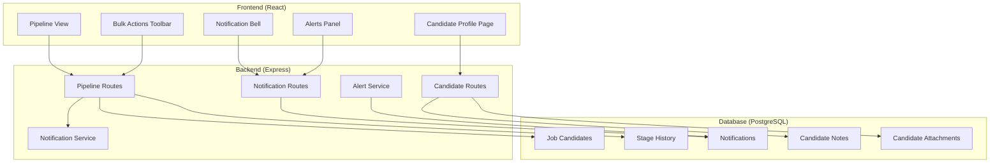
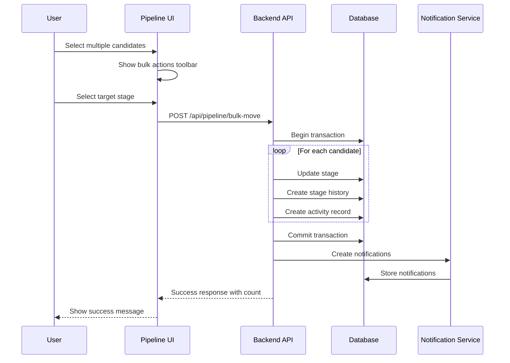

# Design Document: Phase 2 - Candidate Pipeline & Workflow Engine

## Overview

This design document outlines the architecture and implementation details for Phase 2 of the SnapFind ATS - the Candidate Pipeline & Workflow Engine. This phase implements comprehensive candidate tracking with bulk operations, stage timestamps for TAT calculation, stage-level comments, enhanced pipeline views, dedicated candidate profile pages, and a notifications/alerts engine.

### Technology Stack

- **Frontend**: React 18+ with TypeScript, React Router, Tailwind CSS
- **Backend**: Node.js with Express.js, TypeScript
- **Database**: PostgreSQL with Prisma ORM
- **Authentication**: JWT (JSON Web Tokens)
- **File Upload**: Multer for attachments
- **State Management**: React Context API, React Query for server state
- **Testing**: Vitest with fast-check for property-based testing

### Design Principles

1. **Event-Driven Architecture**: Stage changes trigger notifications and alerts
2. **Optimistic Updates**: UI updates immediately with rollback on failure
3. **Batch Processing**: Bulk operations use database transactions
4. **Real-Time Metrics**: TAT and SLA calculations update dynamically

## Architecture



### Bulk Stage Movement Flow



## Components and Interfaces

### Frontend Components

#### Bulk Actions Toolbar Component

```typescript
interface BulkActionsToolbarProps {
  selectedCandidates: string[];
  stages: PipelineStage[];
  onBulkMove: (targetStageId: string, comment?: string) => Promise<void>;
  onClearSelection: () => void;
  isLoading: boolean;
}

interface BulkMoveResult {
  success: boolean;
  movedCount: number;
  failedCount: number;
  failures?: { candidateId: string; error: string }[];
}
```

#### Stage Movement Modal Component

```typescript
interface StageMovementModalProps {
  isOpen: boolean;
  onClose: () => void;
  candidate: Candidate;
  currentStage: PipelineStage;
  availableStages: PipelineStage[];
  onMove: (targetStageId: string, comment: string) => Promise<void>;
  requireComment?: boolean; // true for rejection stages
}
```

#### Candidate Profile Page Component

```typescript
interface CandidateProfilePageProps {
  candidateId: string;
}

interface CandidateProfileData {
  candidate: Candidate;
  activities: CandidateActivity[];
  notes: CandidateNote[];
  attachments: CandidateAttachment[];
  stageHistory: StageHistoryEntry[];
  jobApplications: JobApplicationWithDetails[];
}
```

#### Notification Bell Component

```typescript
interface NotificationBellProps {
  userId: string;
}

interface NotificationState {
  notifications: Notification[];
  unreadCount: number;
  isLoading: boolean;
}
```

#### Pipeline Stage Card Component

```typescript
interface PipelineStageCardProps {
  stage: PipelineStage;
  candidateCount: number;
  slaBreachCount: number;
  isSelected: boolean;
  onClick: () => void;
}
```

### Backend API Interfaces

```typescript
// Bulk stage movement endpoint
POST /api/pipeline/bulk-move
  Request: {
    candidateIds: string[];
    targetStageId: string;
    jobId: string;
    comment?: string;
  }
  Response: {
    success: boolean;
    movedCount: number;
    failedCount: number;
    failures?: { candidateId: string; error: string }[];
  }

// Stage history endpoint
GET /api/candidates/:id/stage-history
  Response: StageHistoryEntry[]

// Candidate notes endpoints
GET /api/candidates/:id/notes
  Response: CandidateNote[]

POST /api/candidates/:id/notes
  Request: { content: string }
  Response: CandidateNote

// Candidate attachments endpoints
GET /api/candidates/:id/attachments
  Response: CandidateAttachment[]

POST /api/candidates/:id/attachments
  Request: FormData (multipart)
  Response: CandidateAttachment

// Notifications endpoints
GET /api/notifications
  Query: { unreadOnly?: boolean; limit?: number }
  Response: { notifications: Notification[]; unreadCount: number }

PUT /api/notifications/:id/read
  Response: { success: boolean }

PUT /api/notifications/mark-all-read
  Response: { success: boolean; count: number }

// Alerts endpoints
GET /api/alerts
  Query: { type?: 'sla' | 'feedback' | 'all' }
  Response: Alert[]

// Pipeline analytics endpoint
GET /api/jobs/:id/pipeline/analytics
  Response: {
    stageMetrics: {
      stageId: string;
      stageName: string;
      candidateCount: number;
      avgDaysInStage: number;
      slaBreachCount: number;
    }[];
    overallTAT: number;
  }
```

## Data Models

### New Database Schema

```prisma
// Stage History - tracks time spent in each stage
model StageHistory {
  id             String    @id @default(uuid())
  jobCandidateId String    @map("job_candidate_id")
  stageId        String    @map("stage_id")
  stageName      String    @map("stage_name")
  enteredAt      DateTime  @default(now()) @map("entered_at")
  exitedAt       DateTime? @map("exited_at")
  durationHours  Float?    @map("duration_hours")
  comment        String?   @db.Text
  movedBy        String?   @map("moved_by")
  
  jobCandidate   JobCandidate @relation(fields: [jobCandidateId], references: [id], onDelete: Cascade)
  stage          PipelineStage @relation(fields: [stageId], references: [id])
  user           User? @relation(fields: [movedBy], references: [id])
  
  @@index([jobCandidateId])
  @@index([stageId])
  @@map("stage_history")
}

// Candidate Notes
model CandidateNote {
  id          String   @id @default(uuid())
  candidateId String   @map("candidate_id")
  content     String   @db.Text
  createdBy   String   @map("created_by")
  createdAt   DateTime @default(now()) @map("created_at")
  updatedAt   DateTime @updatedAt @map("updated_at")
  
  candidate   Candidate @relation(fields: [candidateId], references: [id], onDelete: Cascade)
  author      User @relation(fields: [createdBy], references: [id])
  
  @@index([candidateId])
  @@map("candidate_notes")
}

// Candidate Attachments
model CandidateAttachment {
  id          String   @id @default(uuid())
  candidateId String   @map("candidate_id")
  fileName    String   @map("file_name")
  fileUrl     String   @map("file_url")
  fileType    String   @map("file_type")
  fileSize    Int      @map("file_size")
  uploadedBy  String   @map("uploaded_by")
  createdAt   DateTime @default(now()) @map("created_at")
  
  candidate   Candidate @relation(fields: [candidateId], references: [id], onDelete: Cascade)
  uploader    User @relation(fields: [uploadedBy], references: [id])
  
  @@index([candidateId])
  @@map("candidate_attachments")
}

// Notifications
model Notification {
  id          String   @id @default(uuid())
  userId      String   @map("user_id")
  type        NotificationType
  title       String
  message     String
  entityType  String?  @map("entity_type") // 'candidate', 'job', 'interview'
  entityId    String?  @map("entity_id")
  isRead      Boolean  @default(false) @map("is_read")
  createdAt   DateTime @default(now()) @map("created_at")
  
  user        User @relation(fields: [userId], references: [id], onDelete: Cascade)
  
  @@index([userId, isRead])
  @@index([createdAt])
  @@map("notifications")
}

enum NotificationType {
  stage_change
  feedback_pending
  sla_breach
  interview_scheduled
  offer_pending
  
  @@map("notification_type")
}

// SLA Configuration
model SLAConfig {
  id          String   @id @default(uuid())
  companyId   String   @map("company_id")
  stageName   String   @map("stage_name")
  thresholdDays Int    @map("threshold_days")
  createdAt   DateTime @default(now()) @map("created_at")
  updatedAt   DateTime @updatedAt @map("updated_at")
  
  company     Company @relation(fields: [companyId], references: [id], onDelete: Cascade)
  
  @@unique([companyId, stageName])
  @@map("sla_configs")
}
```

### TypeScript Types

```typescript
// Stage History
interface StageHistoryEntry {
  id: string;
  jobCandidateId: string;
  stageId: string;
  stageName: string;
  enteredAt: Date;
  exitedAt?: Date;
  durationHours?: number;
  comment?: string;
  movedBy?: string;
  movedByName?: string;
}

// Candidate Note
interface CandidateNote {
  id: string;
  candidateId: string;
  content: string;
  createdBy: string;
  authorName: string;
  createdAt: Date;
  updatedAt: Date;
}

// Candidate Attachment
interface CandidateAttachment {
  id: string;
  candidateId: string;
  fileName: string;
  fileUrl: string;
  fileType: string;
  fileSize: number;
  uploadedBy: string;
  uploaderName: string;
  createdAt: Date;
}

// Notification
interface Notification {
  id: string;
  userId: string;
  type: 'stage_change' | 'feedback_pending' | 'sla_breach' | 'interview_scheduled' | 'offer_pending';
  title: string;
  message: string;
  entityType?: 'candidate' | 'job' | 'interview';
  entityId?: string;
  isRead: boolean;
  createdAt: Date;
}

// SLA Configuration
interface SLAConfig {
  id: string;
  companyId: string;
  stageName: string;
  thresholdDays: number;
}

// Bulk Move Request
interface BulkMoveRequest {
  candidateIds: string[];
  targetStageId: string;
  jobId: string;
  comment?: string;
}

// Pipeline Analytics
interface PipelineAnalytics {
  stageMetrics: StageMetric[];
  overallTAT: number;
}

interface StageMetric {
  stageId: string;
  stageName: string;
  candidateCount: number;
  avgDaysInStage: number;
  slaBreachCount: number;
}
```

## Correctness Properties

*A property is a characteristic or behavior that should hold true across all valid executions of a system-essentially, a formal statement about what the system should do. Properties serve as the bridge between human-readable specifications and machine-verifiable correctness guarantees.*

Based on the acceptance criteria analysis, the following correctness properties must be validated:

### Bulk Movement Properties

**Property 1: Bulk movement moves all selected candidates**
*For any* set of selected candidate IDs and valid target stage, executing bulk move should result in all candidates having the target stage as their current stage.
**Validates: Requirements 1.3**

**Property 2: Bulk movement creates activity records**
*For any* bulk move operation with N candidates, exactly N activity records should be created with type 'stage_change'.
**Validates: Requirements 1.4**

**Property 3: Partial bulk failures continue processing**
*For any* bulk move operation where some candidates fail validation, the remaining valid candidates should still be moved successfully.
**Validates: Requirements 1.6**

### Stage Timestamp Properties

**Property 4: Stage entry records timestamp**
*For any* candidate entering a new stage, a stage history record should be created with enteredAt timestamp equal to the current time (within tolerance).
**Validates: Requirements 2.1**

**Property 5: Stage exit records timestamp**
*For any* candidate exiting a stage, the corresponding stage history record should have exitedAt timestamp set.
**Validates: Requirements 2.2**

**Property 6: Duration calculation correctness**
*For any* stage history entry with both enteredAt and exitedAt, the durationHours should equal (exitedAt - enteredAt) in hours.
**Validates: Requirements 2.3**

**Property 7: Average TAT calculation**
*For any* set of stage history entries for a stage, the average TAT should equal the sum of durations divided by the count of entries.
**Validates: Requirements 2.4**

**Property 8: SLA threshold flagging**
*For any* candidate where (currentTime - stageEnteredAt) exceeds the SLA threshold for that stage, the candidate should be flagged as "at risk".
**Validates: Requirements 2.5**

### Stage Comment Properties

**Property 9: Stage movement comments round-trip**
*For any* stage movement with a comment, retrieving the activity timeline should include that comment in the corresponding activity record.
**Validates: Requirements 3.2, 3.3**

**Property 10: Rejection requires comment**
*For any* stage movement to a rejection stage without a comment, the operation should fail with a validation error.
**Validates: Requirements 3.4**

### Pipeline View Properties

**Property 11: Stage counts match actual candidates**
*For any* pipeline stage, the displayed candidate count should equal the actual number of candidates in that stage in the database.
**Validates: Requirements 4.1**

**Property 12: Stage filter shows matching candidates**
*For any* selected stage filter, all displayed candidates should have that stage as their current stage.
**Validates: Requirements 4.2**

**Property 13: Filter updates counts and list**
*For any* applied filter (skills, experience, source), both the stage counts and candidate list should reflect only candidates matching the filter criteria.
**Validates: Requirements 4.4**

### Candidate Profile Properties

**Property 14: Profile shows all parsed fields**
*For any* candidate profile, the rendered page should display name, email, phone, experience, skills, and all other stored fields.
**Validates: Requirements 5.3**

**Property 15: Activity timeline completeness**
*For any* candidate, the activity timeline should include all stage changes, notes added, and other activities in chronological order.
**Validates: Requirements 5.4**

### Notes Properties

**Property 16: Notes stored with metadata**
*For any* note added to a candidate, the stored note should include content, timestamp, and author ID.
**Validates: Requirements 6.2**

**Property 17: Notes reverse chronological order**
*For any* candidate with multiple notes, retrieving notes should return them sorted by createdAt descending.
**Validates: Requirements 6.3**

### Attachment Properties

**Property 18: Attachment validation**
*For any* file upload, files with extensions PDF, DOC, DOCX, PNG, JPG, JPEG and size under 10MB should be accepted; others should be rejected.
**Validates: Requirements 6.4**

**Property 19: Attachment metadata display**
*For any* stored attachment, the display should include fileName, createdAt, and a valid download URL.
**Validates: Requirements 6.5**

### Tag Properties

**Property 20: Tag filtering returns matching candidates**
*For any* tag filter, all returned candidates should have that tag in their tags array.
**Validates: Requirements 7.3**

**Property 21: Tags display on candidate cards**
*For any* candidate with tags, the candidate card should render all tags as visible badges.
**Validates: Requirements 7.4**

**Property 22: Tag removal updates immediately**
*For any* tag removal operation, subsequent retrieval of the candidate should not include the removed tag.
**Validates: Requirements 7.5**

### Notification Properties

**Property 23: Stage change creates notification**
*For any* stage change, a notification should be created for relevant users (recruiter, hiring manager assigned to the job).
**Validates: Requirements 8.1**

**Property 24: Notification read status updates**
*For any* notification marked as read, the isRead field should be true and the unread count should decrement by 1.
**Validates: Requirements 8.5**

### Alert Properties

**Property 25: Pending feedback alert timing**
*For any* interview completed more than 24 hours ago without feedback, a pending feedback alert should exist.
**Validates: Requirements 9.1**

**Property 26: Feedback dismisses alert**
*For any* interview with a pending feedback alert, submitting feedback should result in the alert being dismissed.
**Validates: Requirements 9.4**

**Property 27: Alert age calculation**
*For any* pending feedback alert, the displayed age should equal (currentTime - interviewCompletedAt) in hours/days.
**Validates: Requirements 9.5**

**Property 28: SLA breach creates alert**
*For any* candidate exceeding the SLA threshold for their current stage, an SLA breach alert should exist.
**Validates: Requirements 10.1**

**Property 29: Stage change dismisses SLA alert**
*For any* candidate with an SLA breach alert, moving them to a new stage should dismiss the alert.
**Validates: Requirements 10.4**

### Data Persistence Properties

**Property 30: Notification data round-trip**
*For any* notification object, serializing to JSON and deserializing should produce an equivalent object.
**Validates: Requirements 11.3, 11.4**

## Error Handling

### Frontend Error Handling

```typescript
// Bulk move errors
interface BulkMoveError {
  type: 'partial_failure' | 'complete_failure' | 'validation_error';
  message: string;
  failures?: { candidateId: string; candidateName: string; error: string }[];
}

// File upload errors
const attachmentErrors = {
  invalidFormat: 'Please upload a PDF, DOC, DOCX, or image file',
  fileTooLarge: 'File size must be less than 10MB',
  uploadFailed: 'Failed to upload file. Please try again.',
};

// Notification errors
const notificationErrors = {
  fetchFailed: 'Failed to load notifications',
  markReadFailed: 'Failed to mark notification as read',
};
```

### Backend Error Handling

```typescript
// Bulk move validation error
class BulkMoveValidationError extends AppError {
  constructor(failures: { candidateId: string; error: string }[]) {
    super(400, 'BULK_MOVE_VALIDATION_ERROR', 'Some candidates could not be moved', { failures });
  }
}

// Comment required error
class CommentRequiredError extends AppError {
  constructor() {
    super(400, 'COMMENT_REQUIRED', 'A comment is required when moving to rejection stage');
  }
}

// SLA configuration error
class SLAConfigError extends AppError {
  constructor(message: string) {
    super(400, 'SLA_CONFIG_ERROR', message);
  }
}
```

## Testing Strategy

### Dual Testing Approach

This project uses both unit testing and property-based testing:

- **Unit tests** verify specific examples, edge cases, and UI rendering
- **Property-based tests** verify universal properties across all valid inputs

### Testing Framework

- **Unit Testing**: Vitest with React Testing Library
- **Property-Based Testing**: fast-check library for TypeScript
- **Integration Testing**: Supertest for API endpoints

### Property-Based Testing Configuration

```typescript
import fc from 'fast-check';

// Configure minimum 100 iterations per property test
fc.configureGlobal({
  numRuns: 100,
  verbose: true
});
```

### Property Test Examples

```typescript
// **Feature: phase2-pipeline-workflow-engine, Property 1: Bulk movement moves all selected candidates**
describe('Property 1: Bulk movement moves all selected candidates', () => {
  it('should move all selected candidates to target stage', () => {
    fc.assert(
      fc.property(
        fc.array(fc.uuid(), { minLength: 1, maxLength: 10 }),
        fc.uuid(),
        async (candidateIds, targetStageId) => {
          const result = await bulkMoveService.move({
            candidateIds,
            targetStageId,
            jobId: testJobId,
          });
          
          // Verify all candidates are now in target stage
          for (const id of candidateIds) {
            const candidate = await getJobCandidate(id);
            expect(candidate.currentStageId).toBe(targetStageId);
          }
          return result.movedCount === candidateIds.length;
        }
      )
    );
  });
});

// **Feature: phase2-pipeline-workflow-engine, Property 6: Duration calculation correctness**
describe('Property 6: Duration calculation correctness', () => {
  it('should calculate duration as exit minus entry in hours', () => {
    fc.assert(
      fc.property(
        fc.date({ min: new Date('2024-01-01'), max: new Date('2024-12-31') }),
        fc.integer({ min: 1, max: 720 }), // 1 to 720 hours
        (enteredAt, hoursInStage) => {
          const exitedAt = new Date(enteredAt.getTime() + hoursInStage * 60 * 60 * 1000);
          const duration = calculateDuration(enteredAt, exitedAt);
          return Math.abs(duration - hoursInStage) < 0.01; // Allow small floating point tolerance
        }
      )
    );
  });
});

// **Feature: phase2-pipeline-workflow-engine, Property 10: Rejection requires comment**
describe('Property 10: Rejection requires comment', () => {
  it('should reject stage movement to rejection without comment', () => {
    fc.assert(
      fc.property(
        fc.uuid(),
        fc.constantFrom('Rejected', 'Not Selected', 'Declined'),
        async (candidateId, rejectionStageName) => {
          const rejectionStage = await getStageByName(rejectionStageName);
          
          await expect(
            moveCandidate({
              candidateId,
              targetStageId: rejectionStage.id,
              comment: '', // Empty comment
            })
          ).rejects.toThrow('comment is required');
          
          return true;
        }
      )
    );
  });
});

// **Feature: phase2-pipeline-workflow-engine, Property 17: Notes reverse chronological order**
describe('Property 17: Notes reverse chronological order', () => {
  it('should return notes sorted by createdAt descending', () => {
    fc.assert(
      fc.property(
        fc.array(
          fc.record({
            content: fc.string({ minLength: 1 }),
            createdAt: fc.date({ min: new Date('2024-01-01'), max: new Date('2024-12-31') }),
          }),
          { minLength: 2, maxLength: 10 }
        ),
        async (notesData) => {
          // Create notes
          for (const note of notesData) {
            await createNote(testCandidateId, note.content, note.createdAt);
          }
          
          // Retrieve notes
          const notes = await getNotes(testCandidateId);
          
          // Verify order
          for (let i = 1; i < notes.length; i++) {
            if (notes[i - 1].createdAt < notes[i].createdAt) {
              return false;
            }
          }
          return true;
        }
      )
    );
  });
});

// **Feature: phase2-pipeline-workflow-engine, Property 18: Attachment validation**
describe('Property 18: Attachment validation', () => {
  it('should accept valid file types under 10MB', () => {
    fc.assert(
      fc.property(
        fc.constantFrom('pdf', 'doc', 'docx', 'png', 'jpg', 'jpeg'),
        fc.integer({ min: 1, max: 10 * 1024 * 1024 }),
        (extension, size) => {
          const file = createMockFile(`document.${extension}`, size);
          const result = validateAttachment(file);
          return result.valid === true;
        }
      )
    );
  });

  it('should reject files over 10MB', () => {
    fc.assert(
      fc.property(
        fc.constantFrom('pdf', 'doc', 'docx'),
        fc.integer({ min: 10 * 1024 * 1024 + 1, max: 50 * 1024 * 1024 }),
        (extension, size) => {
          const file = createMockFile(`document.${extension}`, size);
          const result = validateAttachment(file);
          return result.valid === false;
        }
      )
    );
  });

  it('should reject invalid file types', () => {
    fc.assert(
      fc.property(
        fc.constantFrom('exe', 'bat', 'sh', 'js', 'php'),
        fc.integer({ min: 1, max: 1024 * 1024 }),
        (extension, size) => {
          const file = createMockFile(`file.${extension}`, size);
          const result = validateAttachment(file);
          return result.valid === false;
        }
      )
    );
  });
});
```

### Test File Structure

```
backend/src/
├── __tests__/
│   ├── properties/
│   │   ├── bulk-move.property.test.ts
│   │   ├── stage-history.property.test.ts
│   │   ├── notifications.property.test.ts
│   │   ├── notes.property.test.ts
│   │   └── attachments.property.test.ts
│   └── unit/
│       ├── pipeline.service.test.ts
│       ├── notification.service.test.ts
│       └── alert.service.test.ts

frontend/src/
├── __tests__/
│   ├── properties/
│   │   ├── bulk-actions.property.test.ts
│   │   ├── pipeline-view.property.test.ts
│   │   └── candidate-profile.property.test.ts
│   └── unit/
│       ├── BulkActionsToolbar.test.tsx
│       ├── NotificationBell.test.tsx
│       └── CandidateProfilePage.test.tsx
```
